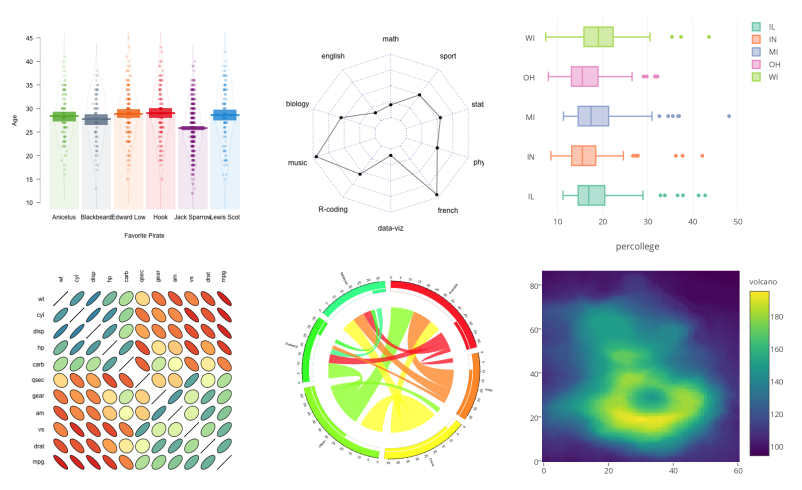
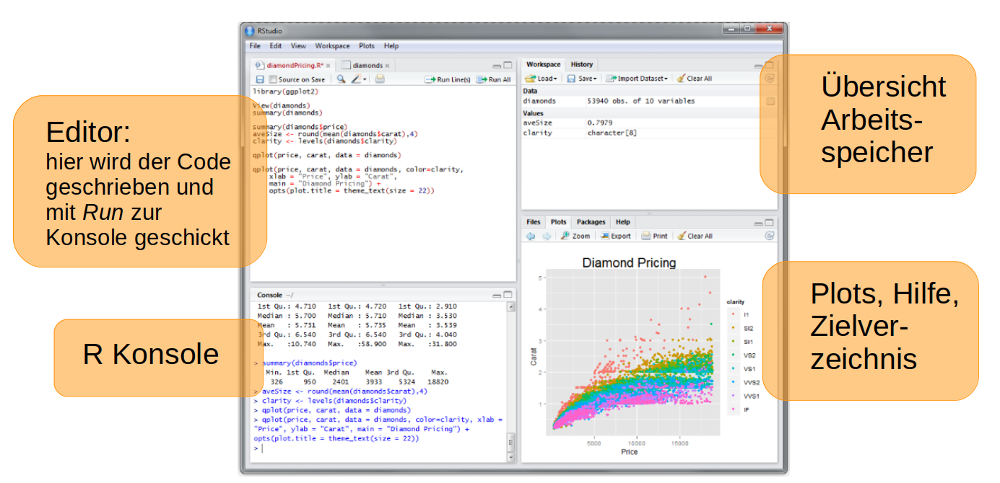
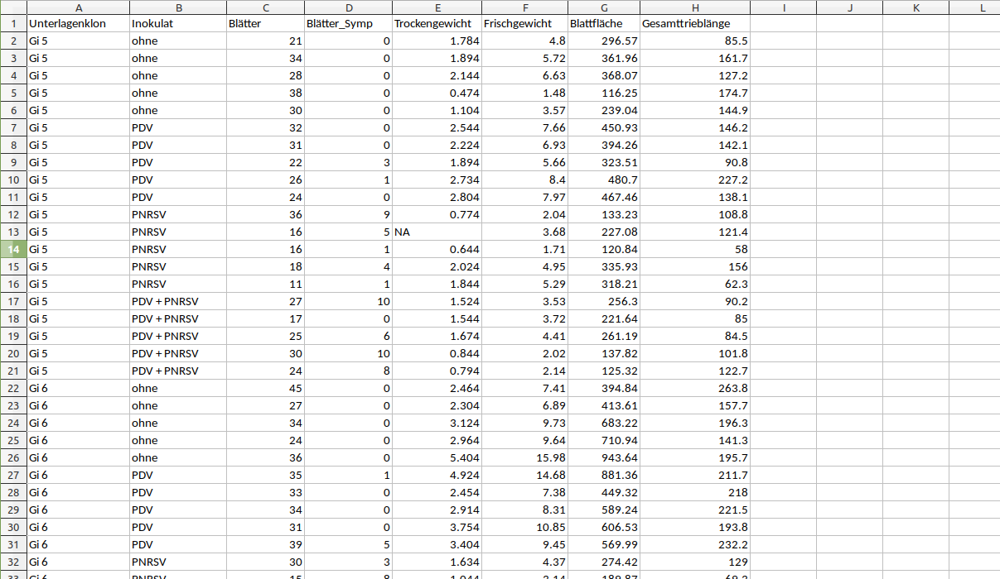

# Einführung R {#einführungR}

In den nächsten Kapiteln werde ich mit Ihnen die Grundzüge der Datenauswertung mit der Statistik-Software R besprechen. Am Ende dieses Kapitels wissen Sie (hoffentlich)

- dass R toll ist
- wie Sie Versuchsdaten am besten in ein Tabellenkalkulationsprogramm eingeben
- wie Sie diese Daten nach R importieren
- wie die grundlegenden Arbeitsschritte in R aussehen
- wo Sie Hilfe bekommen

---


## Was ist R?

R ist eine Programmiersprache, die zur Datenanalyse entwickelt wurde und damit eine Alternative zu Programmen wie SPSS, SAS und den Statistik-Funktionen von Excel. Die zwei größten Vorteile von R gegenüber point-and-click Programmen sind:

1) Der Funktionsumfang ist grundsätzlich nicht beschränkt → durch Programmierung unendlich erweiterbar → Über 10.000 Software-Pakete, die verschiedenste Analyseverfahren ermöglichen
2) Die Analysen mit R sind reproduzierbar und transparent! Analyse kann ohne Aufwand wiederholt werden, z.B. nach Fehler in den Rohdaten. Jeder, der den Code sieht (und versteht), kann nachvollziehen, wie die Daten verwendet worden sind. 

Weitere Vorteile sind:

- die Software ist open source also kostenfrei verfügbar
- sie läuft auf allen gängigen Betriebssystemen
- es gibt verschiedene Editoren, die die Nutzung erleichtern, der bekannteste ist R-Studio
- es gibt eine sehr aktive Community im Netz, die Hilfe bietet, oft innerhalb von Minuten bis Stunden

R ist auch eine Investition in Ihre (berufliche) Zukunft. Außer Daten auswerten kann man damit

- komplexe und schöne Graphiken erzeugen (siehe Abbildung unten)
- Berichte, Paper und Bücher schreiben (auch Bachelor- und Masterarbeiten)
- Web-Seiten erstellen (wie diese hier)
- Apps entwickeln
- Simulationsmodelle implementieren
- Eigene Methoden entwickeln und veröffentlichen



Ganz allgemein gilt R zunehmend als *die* Standardsprache für statistische Problemstellungen sowohl in der Wirtschaft als auch in der Wissenschaft [@amirtha_how_2014].

## R und R-Studio installieren

1) Zuerst sollten Sie die eigentliche Programmiersprache R installieren. Auf dieser Seite finden Sie Downloads für verschiedene Betriebssysteme: 

https://www.r-project.org 

Sie gelangen hier auf eine Seite mit einem Link zum R-download. Folgen Sie diesem Link und suchen Sie dann einen CRAN-mirror aus. Im Prinzip ist egal, welchen Sie wählen (auf allen sind die gleichen Ressources verfügbar, deshalb 'Spiegel'), es macht aber Sinn, einen Mirror in der Nähe zu wählen. Es wird dann ein Installationsprogramm (z.B. eine exe-Datei oder eine .deb Datei) heruntergeladen. Wenn Sie diese öffnen, werden Sie durch die Installation geführt - bei den Auswahlmöglichkeiten passen normalerweise voreingestellten Optionen. 

2) Dann (und erst dann! sonst kann es zu Konfigurationsproblemen kommen) installieren Sie auch noch einen Editor für R. Der Editor ist hauptsächlich dafür da, den Code, zum Beispiel für statistische Analysen, zu schreiben, zu kommentieren und zu speichern. R-Studio ist der bekannteste und wahrscheinlich beste Editor: 

https://www.rstudio.com/products/rstudio/download/#download  

Wenn Sie R-Studio öffnen, sehen Sie vier Fenster: den eigentlich Editor, in dem Sie R-code schreiben, die R Konsole, in der die aktive R-Session läuft, eine Übersicht über den Arbeitsspeicher und unten rechts ein Fenster in dem je nach Aktion Plots, Hilfedateien oder die Ordnerstruktur und Dateien des Verzeichnisses, in dem der R-Prozess gestartet wurde, zu sehen sind. Eventuell fehlt auch der Editor oben links noch, das ändert sich aber, wenn Sie ein neues Skript anlegen (siehe 'Erste Schritte mit R')



## Erste Schritte mit R

- Ein neues Skript im Editor öffnen, um Code schreiben zu können
(File → new file → R-Script)
- R als Taschenrechner benutzen: In den Editor
```
5 + 7
``` 

schreiben → auf den 'Run' Button klicken (über dem Editor) → der Code wird an den laufenden R Prozess in der Konsole geschickt und das Ergebnis in der Konsole ausgegeben

- Eine Variable anlegen: im Editor 
```
Ergebnis1 <- 5 + 7
``` 

eingeben → Run-Button anklicken → nichts passiert außer dass die Zeile in der Konsole auftaucht? → das Ergebnis wird in der Variable *Ergebnis1 * gespeichert, diese Variable wird jetzt auch in der Übersicht des Arbeitsspeichers gelistet. Wenn man in der Konsole 
```
Ergebnis1
```

eingibt, wird der Wert der Variable ausgegeben. Anstelle des Pfeils kann auch ein = verwendet werden.

- Kommentare schreiben: Damit andere oder unsere zukünftigen Ichs später noch wissen, was wir warum gemacht haben, kann und sollte man in das R-Skript Kommentare schreiben. Wenn solche Zeilen zum R-Prozess geschickt werden, werden sie einfach ignoriert. Ein Kommentar wird mit einem Raute-Zeichen (hash) eingeleitet.
```
# Hier benutzen wir R als Taschenrechner
Ergebnis1 <- 5 + 7
```
- das Skript speichern: File → Save    Dabei werden nicht die Variablen, Ergebnisse und Daten gespeichert (das lernen wir später). Sie können aber mit einem Knopfdruck das gesamte Skript laufen lassen und so alle Arbeitsschritte wiederholen → alle Ergebnisse wieder herstellen.

## Importieren von Daten aus Excel/LibreOffice nach R

1. Daten in Excel/LibreOffice eingeben
    - Häufige Fehlerquelle! Am besten zu zweit: einer liest vor, einer tippt. Zwei/drei durch zwo/drei disambiguieren. Wenn nur eine Person die Daten eingibt, am besten den Nummernblock der Tastatur verwenden und Zahlen blind eingeben, also nur auf Zettel und Bildschirm schauen. Eingegebene Daten danach nochmal prüfen.
    - Keine leeren Zellen im Datenblock  → wenn die Werte fehlen: “NA” (= not available)
    - Erste Reihe wird per default als Spaltenüberschrift interpretiert, hier aussagekräftige aber nicht zu lange Überschriften wählen
    - Zeichenketten (wie Überschriften) sollten aus einem einzigen Wort bestehen. Wenn nötig, zum Beispiel Unterstriche verwenden um einzelne Wörter zu verbinden
    - Als Dezimaltrenner sollte ein Punkt genutzt werden → “7.5” nicht “7,5”  
    - Pro Beobachtung sollte es eine Zeile geben
2. Die Daten in csv-Format speichern
3. Die Datei mit der Funktion read.csv() importieren. 

``` 
kirschen <- read.csv(“Kirschen.csv”)
```

Die Datei 'Kirschen.csv' können Sie hier herunterladen:    
https://ecampus.uni-bonn.de/goto_ecampus_file_3187959_download.html
   
Wenn die R-Session nicht im gleichen Ordner läuft, in dem auch die Datei gespeichert ist, wird R eine Fehlermeldung ausgeben, dass es die Datei nicht finden kann. Entweder, Sie geben dann den gesamten Pfad bis zur Datei ein (z.B. "~/Downloads/Kirschen.csv") oder - am einfachsten - folgenden Code:
```
kirschen <- read.csv(file.choose())
```
Es öffnet sich dann ein Browser-Fenster (manchmal nicht im Vordergrund), in dem Sie die Datei suchen und auswählen können. Das ist nicht ganz ideal, weil nicht unbedingt reproduzierbar (eventuell gibt es zwei oder mehr verschiedene Dateien mit dem Namen "Kirschen.csv" auf Ihrem Computer...), ist aber immerhin leicht zu händeln. Sauberere Lösungen zeigen wir Ihnen im nächsten Kapitel.




## Daten kontrollieren

Wenn Sie die Daten in R eingelesen haben, sollten Sie als erstes kontrollieren, ob der Import geklappt hat. Eine erste Übersicht bekommen Sie mit den Funktionen ```summary()``` und ```head()```

```
summary(kirschen)
# gibt eine Zusammenfassung der Daten mit Mittelwerten etc. aus

head(kirschen)
# Zeigt die ersten 6 Zeilen des Datensatzes, wie er in R eingelesen wurde
```
Hier prüft man unter anderem, ob die Daten den richtigen Typ haben, zum Beispiel die Blockbezeichnungen als Faktoren und nicht als Zahlen interpretiert werden. Ist das nicht der Fall, kann es jetzt geändert werden (→ späteres Kapitel).

Auch einfache Plots sind ein gutes Mittel, um eine erste Vorstellung der Daten zu bekommen und Auffälligkeiten wie extreme Werte (verrutscher Punkt in den Zahlen) zu entdecken. Dafür eignen sich

- die einfach plot-Funktion
    
    ```
    plot(kirschen$Inokulat, kirschen$Frischgewicht, 
     main = "Inokulat", ylab = "Frischgewicht der Blätter [g]")
     ```
- oder eine schönere Version mit dem Paket 'ggplot2'. Dazu muss das Paket 'ggplot2' erst installiert werden. In R-Studio geht das über 'Tools -> Install Packages' -> a search in the 'Packages' field.

     ```
     library(ggplot2)    
     ggplot(kirschen, aes(x=Inokulat, y=Frischgewicht)) +  
       geom_boxplot(notch=TRUE)
     ```
     


## Hilfe bekommen

Hilfe zu finden ist zu Beginn des Arbeitens mit R die wichtigste Kompetenz überhaupt. Am einfachsten ist es natürlich, wenn Sie direkte Unterstützung durch jemanden bekommen, der sich mit R auskennt (und das ist bei der Bachelor-Arbeit - zumindest im Gartenbau - natürlich der Fall). Es gibt aber auch eine Reihe anderer Möglichkeiten:

1. in R selbst     
    - ein “?” vor den Funktionsnamen setzen ```?sd()``` → es öffnet sich eine Hilfedatei,
    - ```help.start()``` → öffnet Hilfeseite mit wichtigen Dokumenten
2. im Internet       
    - Bei der Suche in der Suchmaschine ein *R* zu der Frage oder der Fehlermeldung hinzufügen (Fehlermeldungen gründlich lesen!) 
    - Nach Tutorials und online Büchern suchen, zum Beispiel YaRrr - the pirates guide to R https://bookdown.org/ndphillips/YaRrr/ 
    - Cheat cheets    
    ...bieten einen Überblick der verfügbaren Funktionen und kurze Beschreibungen zu einem bestimmten Thema. Hier finden Sie eine Sammlung von cheat cheets:
https://www.rstudio.com/resources/cheatsheets/
Hier ein cheat sheet mit den grundlegenden Funktionen: https://iqss.github.io/dss-workshops/R/Rintro/base-r-cheat-sheet.pdf

