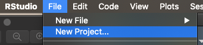
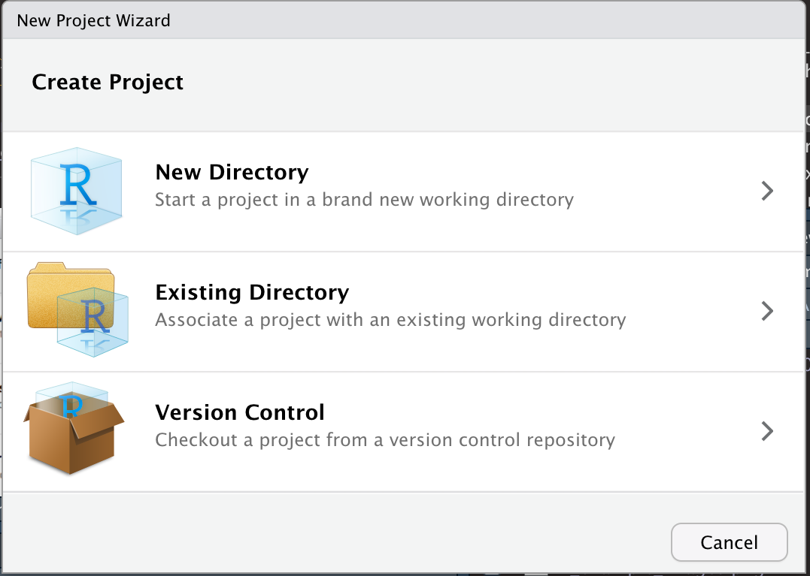
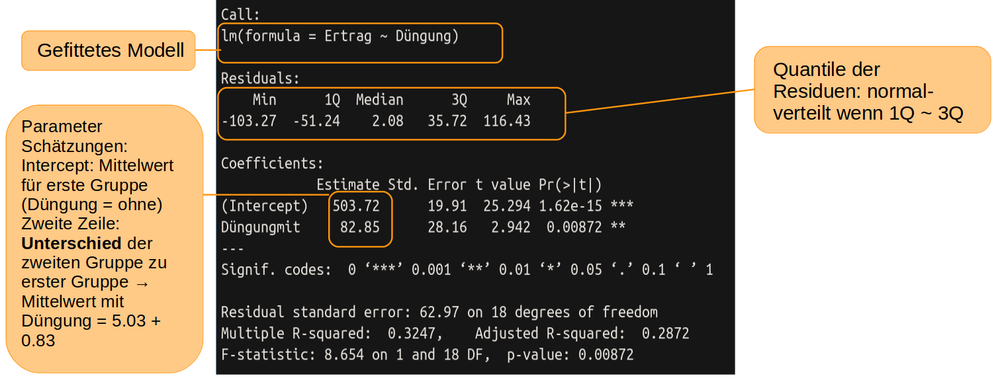
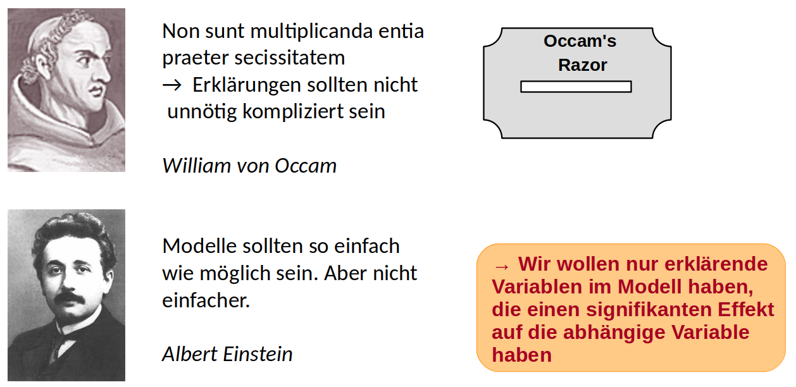
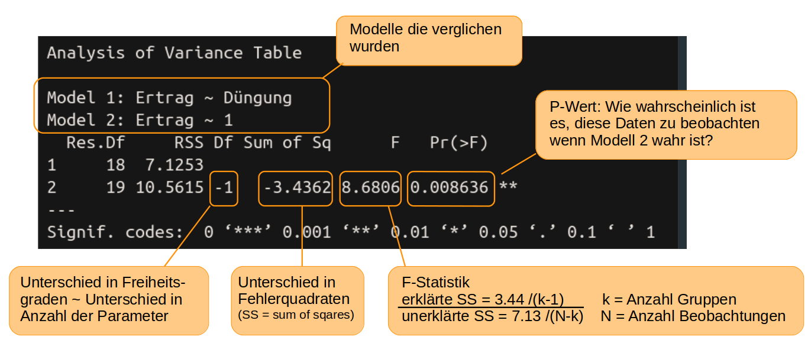

# Daten vorbereiten, Prinzip Anova {#daten}

Nachdem Sie nun R und R-Studio kennengelernt und ein paar erste Versuche gemacht haben, stellen wir Ihnen in diesem Kapitel die wichtigsten Arbeitsschritte für ein Datenprojekt mit R vor, die Ihnen helfen, ihre Arbeit zu organisieren und die Daten in ein auswertbares Format zu bringen. Am Ende des Kapitels wissen Sie

- dass Sie ihre Dateien am besten in sogenannten R-Projekten organisieren
- welche häufigen Datentypen es gibt und wie sie ineinander umgewandelt werden können
- wie Sie Datensätze mit dem Paketbündel 'tidyverse' transformieren und manipulieren können

---

## R-Projekte

R-Projekte sind gewissermaßen das zu Hause von allen R-Skripten und Daten, die zu einem Projekt (zum Beispiel einem Experiment) gehören. Dabei ist ein Projekt aber mehr als nur ein Ordner. Die Vorteile eines Projekts im Vergleich zu einer einzelnen neuen R Script-Datei sind, dass

- beim Öffnen des Projekts das Arbeitsverzeichnis automatisch auf den Ordner gesetzt wird, in dem sich die Projekt-Datei befindet. Man kann dann Dateien direkt aufrufen/einlesen ohne den vollständigen Pfad angeben zu müssen (höchstens Unterordner, wenn man denn welche angelegt hat). In Bezug auf das letzte Kapitel sollte jetzt also ``` kirschen <- read.csv("Kirschen.csv")```
immer funktionieren, wenn die Datei 'Kirschen.csv' im gleicher Ordner, wie die .Rproj-Datei liegt.
- RStudio bei einem Neustart alle Dateien wieder öffnet, die beim letzten Schließen offen waren
- man gleichzeitig mehrere Projekte offen haben kann, ohne durcheinander zu kommen
- man das ganze Projekt komplett mit richtigen Verknüpfungen zwischen Daten/Dateien weiterreichen kann und die Skripte (zumindest bei gleicher R-Version) auf jedem Rechner reproduziert werden können.


Sie können ein RStudio-Projekt sowohl in einem neuen Verzeichnis als auch in einem vorhandenen Verzeichnis, in dem Sie bereits R-Code und Daten haben, erstellen. Um ein neues Projekt zu erstellen, verwenden Sie den Befehl 'File -> New Project'. 


Es öffnet sich dann ein Fenster, in dem Sie entscheiden können, ob Sie das Projekt in einem neuen Verzeichnis, einem schon existierenden Verzeichnis oder mit Versionskontrolle (zum Beispiel mit git) anlegen wollen. Letzteres ist sehr sinnvoll, würde hier aber den Rahmen sprengen.



Durch das Anlegen eines neuen Projekts in RStudio wird eine Projektdatei (mit der Erweiterung .Rproj) im Projektverzeichnis erstellt. Diese Datei kann später als Verknüpfung zum direkten Öffnen des Projekts verwendet werden. 

## Datentypen und -transformationen

Das Einlesen der Daten sollte jetzt kein Problem mehr sein, allerdings haben die Daten manchmal nicht den Datentyp der für bestimmte statistische Auswertungen oder Abbildungen gebraucht wird. Zuerst eine Übersicht über die gängigsten Typen:

|  Bezeichnung |  Beispiele
| ------------|-----------
|integer|  1, -2, 3, (NA)
|numeric | 32.5, 74.3, (NA)
|character | 'ein Wort', "ein Wort", (NA)
|logical | TRUE, FALSE, T, F, (NA)
|factor  | treat1, treat2, treat3, (NA)
| date | 2022-10-24, (NA)

Mit der Funktion ``` str()```kann man testen, als welche Datentypen R die Daten interpretiert und bekommt eine Übersicht der Struktur des Datensatzes: 

``` 
str(kirschen)
``` 

Wie oben erwähnt, werden für einige Auswertungen/Abbildungen manchmal andere Datentypen benötigt, als R erkannt hat. So werden zum Beispiel manchmal die Bezeichnungen für Behandlungsgruppen als 'character' eingelesen, für eine Varianzanalyse werden aber Faktoren benötigt. In diesem Fall kann der Datentyp mit der Funktion ```as.factor()``` umgewandelt werden.

``` 
kirschen$Inokulat <- as.factor(kirschen$Inokulat)
``` 

Das geht natürlich nur, wenn der neue Datentyp zu der umzuwandelnden Variablen passt: 'Gi_12' kann nicht in eine numerische Variable umgewandelt werden, wohl aber die Zahlen 1, 2, 3, .. in Faktoren (die dann als "1", "2", "3" ausgegeben werden). Andere häufig genutzte Funktionen sind ``` as.numeric()``` , ``` as.character()``` und ``` as.Date()```.  


## Umgang mit NAs

Auch NAs können manchmal zu Fehlermeldungen oder unvollständigen Abbildungen führen. Da NA nicht Null bedeutet, sondern eher 'wissen wir nicht', kann zum Beispiel nicht ohne Weiteres ein Mittelwert berechnet werden.

```
Daten <- c(5, 3, 9, NA, 4, NA)
mean(Daten)
``` 
Die meisten Funktionen haben aber die Option, NA-Werte bei der Berechnung auszuschließen:
``` 
mean(Daten, na.rm = TRUE)
``` 
Schauen Sie also am besten zuerst in der Hilfe zu der Funktion , die Sie verwenden möchten (```?mean ```), ob es ein Funktionsargument gibt, das den Umgang mit NA-Werten festlegt und ändern Sie die Einstellung entsprechend. Wenn es gar nicht anders geht, kann man als Alternative auch die Zeilen in den NAs vorkommen vor der Analyse herausfiltern. Wie solche Daten-Operationen funktionieren, lernen Sie im folgenden Kapitel.

## Datensätze umstrukturieren

Manchmal ist es nötig, den eingelesenen Datensatz umzustrukturieren, Teildatensätze herauszufiltern oder nue Variablen zu berechnen. Dazu sollte man am besten das Paketbündel 'tidyverse' installieren. Hat man das getan, steht auch eine weitere Konvertierungsfunktion zur Verfügung, die aus einem normalen Datensatz (data.frame) ein 'tibble' macht. Tibble haben ein paar Vorteile, zum Beispiel, dass standardmäßig nur die ersten 10 Zeilen ausgegeben werden und zu jeder Spalte der Datentyp gleich dabei steht (wobei Fließkommazahlen hier nicht als numeric sondern double (dbl) bezeichnet werden. 'fct' steht für Faktor, 'int' für Integer).
```
kirschen <- as_tibble(kirschen)
kirschen
```

### Der Pipe-Operator

Einer der wichtigsten Operatoren des tidyverse ist der Pipe-Operator ```%>% ```. Mit ihm leiten wir ein Objekt (zum Beispiel einen Datensatz) an eine Funktion weiter. Lesen können wir ihn als 'dann'. Anstelle von

```
Daten <- c(5, 9, 2, 5, 3, 9, 5, 3, 5)
Ergebnis <- round(sqrt(sum(Daten^2)), 3)
Ergebnis
```
oder
```
Daten_quad <- Daten^2
Daten_quad_sum <- sum(Daten_quad)
Daten_quad_sum_wurzel <- sqrt(Daten_quad_sum)
Ergebnis <- round(Daten_quad_sum_wurzel, 3)
```

können wir jetzt schreiben

```
Ergebnis <- Daten^2 %>%   
            sum() %>%     
            sqrt() %>%    
            round(3)      
```
Gelesen: wir nehmen die quadrierten Daten, dann berechnen wir die Summe, dann nehmen wir die Quadratwurzel und dann runden wir auf 3 Nachkommastellen. Wir wollen hier aber keine mathematischen Berechnungen durchführen sondern Datensätze bearbeiten und umordnen. Die dafür bereitgestellten Funktionen können aber genauso mit dem Pipe-Operator genutzt werden. Hier wiederum nur die wichtisten: 

| Funktion |  Verwendung
| -------|-----------
|drop_na()|  löscht alle Zeilen des Datensatzes die NAs enthalten
|  select() | wählt Spalten aus
|  filter() | wählt Zeilen aus
| mutate()  | erstellt neue Variablen oder ersetzt scho vorhandene
| group_by () |  Berechnungen an Untergruppen von Daten
|arrange() | sortiert den Datensatz nach einer bestimmten Variable
| pivot_wider() | verringert die Anzahl der Zeilen, erhöht die Anzahl der Spalten
| pivot_longer() | erhöht die Anzahl der Zeilen, verringert die Anzahl der Spalten


### drop_na()

Der Funktionsname spricht für sich: alle Zeilen des Datensatzes, die ein NA enthalten werden komplett aus dem Datensatz gelöscht:
```
library(tidyverse)
# mit der Funktion 'tibble()' legt man einen Datensatz an
Daten1 <- tibble(spalte1 = c(1, NA, 5, 7), spalte2 = c("a", "b", NA, "d"))
# wir schauen uns den Datensatz an:
Daten1
# wir löschen die Zeilen mit NA heraus
Daten2 <- Daten1 %>% drop_na()
# uns sehen uns das Ergebnis an:
Daten2
```

### select()

Mit der Funktion select() können sehr einfach Spalten ausgewählt werden. Hier verwenden wir zusätzlich die Funktion head() um nur die ersten 6 Spalten ausgeben zu lassen:

```
kirschen %>% select(Trockengewicht, Blattfläche) %>% head()
```

Mit einem Minus vor der Spaltenüberschrift, werden die entsprechenden Spalten ausgeschlossen: 
```
kirschen %>% select(-Trockengewicht, -Blattfläche) %>% head()
```
Wenn der Teildatensatz gespeichert werden soll, muss er einem Variablennamen zugewiesen werden

```
kirschen_neu <- kirschen %>% select(-Trockengewicht, -Blattfläche)
head(kirschen_neu)
```


### filter()

...funktioniert analog mit Zeilen. Hier wird allerdings mit einem doppelten Gleichzeichen geprüft, welche Bedingung erfüllt sein muss, um im Datensatz zu bleiben. 

```
kirschen_nurPDV <- kirschen %>% filter(Inokulat == "PDV")
summary(kirschen_nurPDV)

```
Aber Achtung! Wie man in der summary sieht, sind trotzdem noch alle 4 Level von 'Inokulat' vorhanden, nur sind die Zähler der Level 'ohne', 'PDV + PNRSV' und 'PNRSV' auf 0 gesetzt. In Analysen und bei Abbildungen würden sie deshalb trotzdem auftauchen. Deshalb ist es wichtig, die nicht mehr benötigten Level mit der Funktion droplevels() herauszuwerfen:

```
plot(kirschen_nurPDV$Inokulat, kirschen_nurPDV$Frischgewicht)

kirschen_nurPDV <- kirschen %>% 
                   filter(Inokulat == "PDV") %>%
                   droplevels()
                   
 plot(kirschen_nurPDV$Inokulat, kirschen_nurPDV$Frischgewicht)                  

```


Genau entgegengesetzt zum ```==```funktioniert das 'ungleich' Symbol ``` != ```. Hiermit würden alle Zeilen im Datensatz bleiben die NICHT "PDV" als Inokulat-Level haben.

### mutate()

Mit mutate() kann man eine neue Variable anlegen oder eine schon vorhandene überschreiben. Das Beispiel erklärt am besten, wie es funktioniert:
```
kirschen %>% mutate(Gesamttrieblänge_m = Gesamttrieblänge/100)
```
### pivot_longer() 

... wird dazu verwendet, aus einem Datensatz im 'weiten' Format ein Datensatz im 'langen' Format zu machen. Häufig ist es zum Beispiel so, dass es bei Zeitreihen (Wachstum eines Baumes) für jeden Messzeitpunkt eine eigene Spalte gibt in der die Größe eingetragen wird. Manchmal ist es aber notwendig, dass alle gemessenen Größen in einer einzigen Spalte untereinander stehen und in der Spalte daneben, der Zeitpunkt als Variable angegeben ist. Wird im Beispiel klarer...

```
Wachstum <- tibble(Baum = c("Nr1", "Nr2", "Nr3", "Nr4"), 
                   Zeitp1 = c(338,459,558,439), 
                   Zeitp2 = c(437,560,729,658), 
                   Zeitp3 = c(469,579,937,774))
                   
Wachstum_lang <- Wachstum %>% 
                 pivot_longer(
                 cols = c(Zeitp1, Zeitp2, Zeitp3),
                 names_to = "Zeitpunkt",
                 values_to = "Größe_cm")
                 
# cols: die Zeilen die zusammengefügt werden sollen
# names_to: neuer Spaltenname des Faktors
# values_to: neuer Spaltenname der Daten

# 'Zeitpunkt' und 'Baum' wurden noch nicht als Faktor erkannt, deshalb:
Wachstum_lang$Zeitpunkt <- as.factor(Wachstum_lang$Zeitpunkt)
Wachstum_lang$Baum <- as.factor(Wachstum_lang$Baum)
```
Dieses lange Format wird zum Beispiel benötigt, um einen ggplot, der das Wachstum darstellt, machen zu können

```
ggplot(Wachstum_lang, aes(x = Zeitpunkt, y = Größe_cm, color=Baum)) + 
   geom_point() +   labs(y="Größe (cm)", x="Zeitpunkt")
```

```{r, fig.width= 8, fig.height=4, echo=FALSE, message = FALSE}
library(tidyverse)
library(ggplot2)

Wachstum <- tibble(Baum = c("Nr1", "Nr2", "Nr3", "Nr4"), 
                   Zeitp1 = c(338,459,558,439), 
                   Zeitp2 = c(437,560,729,658), 
                   Zeitp3 = c(469,579,937,774))

Wachstum_lang <- Wachstum %>% 
                 pivot_longer(
                 cols = c(Zeitp1, Zeitp2, Zeitp3),
                 names_to = "Zeitpunkt",
                 values_to = "Größe_cm")

ggplot(Wachstum_lang, aes(x = Zeitpunkt, y = Größe_cm, color=Baum)) + 
   geom_point() +   labs(y="Größe (cm)", x="Zeitpunkt") 
```


### pivot_wider() 

Und ganz zum Schluss noch die Umkehrfunktion von pivot_longer(): pivot_wider. Sie nimmt einen Faktor und eine Messvariable und “verteilt” die Werte der Messvariable über neue Spalten, welche die Stufen des Faktors repräsentieren:

```
Wachstum_ww <- Wachstum_lang %>% 
               pivot_wider(
               names_from = "Zeitpunkt",
               values_from = "Größe_cm"
               )
```


## Kontinuierliche Daten auswerten {#kontinuierlich}

Bevor wir in die eigentliche Datenanalyse einsteigen, ist es wichtig, dass Sie das Grundprinzip der statistischen Tests verstanden haben. Auf die Gefahr hin, dass es eine Wiederholung für einige von Ihnen ist, wollen wir deshalb nochmal die Idee der Varianzanalyse, die den meisten Tests zugrunde liegt, erklären. Am Ende dieses Kapitels

-   haben Sie die Logik der Varianzanalyse verstanden
-   können Sie etwas mit den Begriffen 'Occams Razor' und 'Homoskedastizität' anfangen
-   sind Sie in der Lage, eine einfache Varianzanalyse mit kontinuierlichen Daten in R durchführen
-   wissen Sie, wie man die Voraussetzungen einer ANOVA visuell testet
-   wissen Sie auch, dass nicht die Daten als Gesamtheit normalverteilt sein müssen, sondern die Daten innerhalb der Behandlungsgruppen, bzw. die Residuen (Fehler, Abstände zum Mittelwert der Gruppe).

------------------------------------------------------------------------

## Das Grundprinzip der Varianzanalyse

Wir nehmen an, wir haben einen sehr einfachen Versuch mit Tomaten durchgeführt, in dem die Hälfte aller 40 Pflanzen gedüngt wird und die andere Hälfte als Kontrollgruppe ungedüngt bleibt. Am Ende bestimmen wir das Gesamtgewicht der Tomaten pro Pflanze als ein Maß für den Ertrag. Jetzt interessiert uns, ob die Düngung einen signifikanten Effekt auf den Ertrag hat. Unsere Hypothese ist: Die Düngung hat einen Effekt auf den Ertrag. Statistisch ausgedrückt bedeutet das, dass die Ertragsdaten aus zwei Normalverteilungen mit unterschiedlichen Mittelwerten stammen. Diese Hypothese ist auf folgender Abbildung auf der linken Seite dargestellt. Das zugehörige statistische Modell hat zwei Parameter: a ist der Mittelwert der Normalverteilung ohne Dünger, b die Differenz zwischen a und dem Mittelwert für die Normalverteilung mit Dünger (die Effektgröße). Die Variable Dünger nimmt entweder den Wert 0 (ohne Dünger) oder 1 (mit Dünger) an. Die Streuung der Daten (sie liegen nicht alle genau auf dem Mittelwert) wird durch den Fehlerterm aufgefangen.


Die Null-Hypothese zu diesem Modell ist: Die Düngung hat keinen Effekt auf den Ertrag -\> die Daten stammen alle aus einer einzigen Normalverteilung mit dem Mittelwert a (rechte Seite der Abbildung). Entsprechend einfacher ist das statistische Modell.

In R formulieren wir diese beiden konkurrierenden Modelle mit der Funktion `lm()`. lm steht für 'linear model' und es schätzt Mittelwert (oder in anderen Fällen auch Achsenabschnitt und Steigung einer Regressionsgeraden), indem es die Werte so wählt, dass die Fehlerquadrate (quadrierter Abstand der Messungen zu den Mittelwerten) möglichst klein sind.

```{r}
# hier lesen wir keine Daten aus Excel ein sondern geben sie einfach händisch direkt 
# in R ein. Zuerst Ertragsdaten von 10 ungedüngten Pflanzen
ohne <- c(417.1,558.8,519.1,611.7,450.3,461.9,517.3,453.2,533.1,514.7)
# dann von 10 gedüngten Pflanzen
mit <- c(581.9,517.4,641.3,659.8,587.8,483.3,703.0,589.5,532.4,569.3)
# hier werden die beiden Datensätze mit c() wie combine
#  zu einem Vektor (= Spalte) zusammengeführt 
Ertrag <- c(ohne, mit)
# jetzt generieren wir noch einen Vektor der die Behandlung anzeigt
Düngung <- gl(2, 10, 20, labels = c("ohne","mit"))
# Mit diesen beiden Vektoren können wir das statistische Modell formulieren, 
# dass der Ertrag von der Düngung abhängt. In R wird das mit der Tilde ~ ausgedrückt
#  (oben links auf der Tastatur). 
# Wir nennen dieses Modell 'model1'
model1 <- lm(Ertrag ~ Düngung)
# mit der folgenden Zeile schauen wir uns eine summary (Zusammenfassung)
#  des gefitteten Modells an
```

    summary(model1)



In der Zeile 'Intercept' finden wir unter 'Estimate' den geschätzten Mittelwert für die Gruppe ohne Düngung, also das a in der Abbildung oben, linke Seite. Darunter, in der Zeile 'Düngungmit' ist die Differenz (das b aus der Abbildung) das auf das a aufaddiert werden muss, um die Schätzung für den Mittelwert der gedüngten Pflanzen zu erhalten.

Als nächstes formulieren wir die Nullhypothese

```{r}
null_model <- lm(Ertrag ~ 1)
summary(null_model)
```

Wie erwartet, erhalten wir jetzt nur einen Mittelwert über alle Tomatenpflanzen.

Welches der beiden Modelle ist nun besser? Das Modell mit Düngung als erklärender Variable passt sich besser an die Daten an -\> kleinere Summe der Fehlerquadrate, ist aber komplizierter.

## Das Prinzip der Parsimonie



Um zu entscheiden, ob eine erklärende Variable einen signifikanten Effekt hat, stellen wir die Frage: Wie wahrscheinlich ist es, die Daten so - oder mit noch größeren Unterschieden zwischen den Behandlungen - zu beobachten, wenn in Wahrheit die erklärende Variable keinen Effekt hat (= die Nullhypothese wahr ist bzw. alle Daten aus einer einzigen Normalverteilung stammen). Um diese Wahrscheinlichkeit ausrechnen zu können, müssen die Daten innerhalb der Behandlungsgruppen normalverteilt sein und die Streuung (Varianz) muss in etwa gleich sein. Das sind die wichtigsten Vorraussetzungen für eine Varianzanalyse, weil sonst evtl. die berechnete Wahrscheinlichkeit nicht stimmt. In R nutzten wir die Funktion `anova()` um die beiden Modelle zu vergleichen und die oben genannte Wahrscheinlichkeit auszurechnen:

    anova(model1, null_model)



Die Wahrscheinlichkeit nach der wir suchen, finden wir unter Pr(\>F) und ist der berühmte p-Wert. Die Wahrscheinlichkeit zufällig solche (oder noch extremere) Daten zu finden, wie wir sie für die Tomaten gefunden haben, obwohl die Düngung in Wahrheit keinen Einfluss auf den Ertrag hat, ist nur 0,86% und damit so unwahrscheinlich, dass wir den Effekt der Düngung als eindeutig signifikant interpretieren können. Damit ist model1 das bessere Model. Eine allgemeine, wenn auch etwas arbiträre Übereinkunft, ist, dass alle Variablen mit einem p-Wert von unter 5% bzw p \< 0.05 als signifikant gelten.

> **Kritik an der Verwendung des p-Wertes**\
> In den letzten Jahren gibt es mehr und mehr Kritik an dem starken Fokus auf den p-Wert. Zum einen, weil zumeist einfach das Signifikanzniveau verwendet wird, was fast immer verwendet wird, ohne weiter darüber nachzudenken: 5%. Dieses Niveau stellt einen Kompromiss zwischen der Fähigkeit eine Entdeckung zu machen und unserer Bereitschaft ein fehlerhaftes Testergebnis zu akzeptieren dar. Es sollte eigentlich einleuchtend sein, dass das Signifikanzniveau für verschiedene Fragestellungen auch unterschiedlich angesetzt werden sollte (was der Begründer der frequentistischen Statistik, Ronald Fisher auch schon 1956 selbst so geraten hat). 
Zum anderen ist der Nachweis eines signifikanten Effekts außer von der Effektgröße stark vom Informationsgehalt der Daten abhängig (wie groß ist die Stichproble). So kann es sein, dass, wenn man hunderte von Proben hat, eine Variable als signifikant nachgewiesen werden kann, ihr Effekt und die wissenschaftliche Relevanz aber nur minimal ist. Es ist also immer, immer wichtig, den Bezug zur eigentlichen Frage und zum untersuchten System zu behalten und die Ergebnisse mit gesundem Menschen- und Sachverstand zu interpretieren. 

## Annahmen der ANOVA überprüfen

Wie oben schon kurz angesprochen, müssen für glaubwürdige Ergebnisse einer Varianzanalyse einige Vorraussetzungen erfüllt sein

1.  Unabhängigkeit der Messungen - das sollte beim Design des Experiments bereits bedacht worden sein.
2.  Keine großen Ausreißer in den Daten - das geht am einfachsten durch das Plotten der Daten und evtl. Ausreißer herausnehmen.
3.  Die abhängige Variable ist innerhalb der Behandlungsgruppen normalverteilt.
4.  Die Varianz in jeder Gruppe sollte annähernd gleich sein. Das wird auch mit dem Begriff Homoskedastizität beschrieben.

Um die Normalverteilung der Daten innerhalb der Behandlungsgruppen zu prüfen, ist es einfacher, sich die Daten nicht gruppenweise anzuschauen, sondern einfach die Residuen/Fehler aller Daten (also den Abstand jedes Datenpunktes zum geschätzten Gruppen-Mittelwert) zu nehmen. Es gibt numerische Tests, um die Normalverteilung der Residuen zu prüfen, in den letzten Jahren setzt sich aber mehr und mehr eine visuelle Überprüfung durch. Am besten eignet sich dafür ein qq-Plot (Quantile-Quantile-Plot). Wenn die Punkte annähernd auf einer Geraden liegen, sind die Residuen normalverteilt. Da 'annähernd' ein dehnbarer Begriff ist, liefert die Funktion `qqPlot` aus dem Package 'car' ein Konfidenzintervall. Liegen die Punkte innerhalb dieses Intervalls, kann man von einer Normalverteilung ausgehen.

```{r}
library(car)
qqPlot(resid(model1))
```

Außer dem Plot gibt die Funktion die 'Namen' der Punkte aus, die im Bezug auf die x-Achse outlier darstellen (also Punkte, die besonders stark abweidchen,hier Punkt 4 und Punkt 17). Es lohnt sich, diese Punkte genauer anzuschauen (waren die Versuchsbedingungen hier aus irgendeinem Grund anders?) und evtl. auszuschließen, insbesondere, wenn sie außerdem außerhalb der Konfidenzlinien liegen.

Eine gute Erklärung wie qq-plots Funktionieren finden Sie hier: <https://www.youtube.com/watch?v=okjYjClSjOg>
... auf Englisch und mit toller Intro :)

Um die Homoskedastizität visuell zu überprüfen, plotten Sie die Residuen gegen die von der Funktion lm() geschätzten Mittelwerte. Wenn die Daten der Gruppen etwa einen gleichen Bereich auf der y-Achse umfassen, sind die Varianzen homogen. Hierfür gibt es leider derzeit keine Konfidenzintervalle, eine Daumenregel ist aber, dass die Varianzen als homogen gelten, wenn die größte Varianz nicht mehr als 1,5fach größer ist als die kleinste Varianz. In unserem Beispiel reichen die Residuen beider Gruppen von etwa -100 bis 100, die Varianzen sind also annähernd gleich groß. Formal kann Varianzhomogenität mit dem Leven's Test überprüft werden. R bietet dazu die Funktion `leveneTest()` aus dem package `car`. Wer interessiert daran ist, kann sich mit `?leveneTest` die Hilfeseite mit Erklärungen zur Anwendung der Funktion anschauen.

```{r}
plot(fitted(model1), resid(model1))
abline(h=0, lty = 3, col = "red")
```

Für unsere Analyse sind alle Annahmen erfüllt. Wir können also davon ausgehen, dass die Düngung in unserem hypothetischen Experiment tatsächlich einen signifikanten Effekt auf den Ertrag hat. In einer Arbeit würden wir den F-Wert (aus summary(model1)), die Anzahl der Freiheitsgrade und den p-Wert angeben, wobei p-Werte, die kleiner als 0.05 sind, üblicherweise mit p \< 0.05 angegeben werden.

