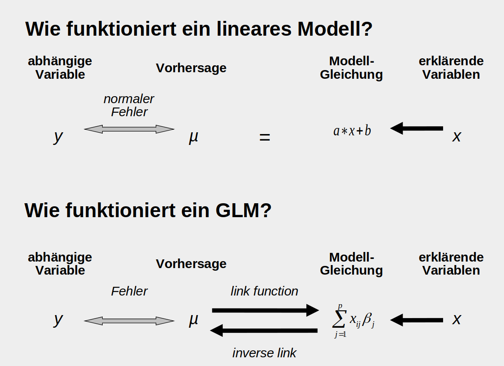

# Zähl- und Boniturdaten auswerten {#zähldaten}

In der letzten Woche haben Sie gelernt, wie man Experimente mit kontinuierlichen Daten der abhängigen Variable auswertet. In den Agrarwissenschaften kommen aber auch häufig andere Datentypen vor. In diesem Kapitel beschäftigen wir uns speziell mit Zähldaten (wieviele Äpfel trägt der Baum? wieviele Läuse sitzen auf der Pflanze? wieviele Eier legt das Huhn?)

Am Ende dieses Kapitels 

- wissen Sie, warum Zähldaten häufig nicht mit einer normalen Varianzanalyse ausgewertet werden können.
- kennen Sie eine Methode, um solche Daten trotzdem zu analysieren.
- sind Sie eine Fallstudie nochmal im Detail durchgegangen.

## Nicht-normalverteilte Daten

Im letzten Kapitel haben wir gesehen, dass eine Voraussetzung für die Durchführung einer ANOVA die Normalverteilung der Residuen (Fehler, Abstände der Messpunkte zum Mittelpunkt) ist. Bei kontinuierlichen Daten wie Größe, Gewicht etc. ist das normalerweise der Fall, wenn das Modell richtig formuliert ist (d.h. wenn alle Faktoren, die einen Einfluss haben, enthalten sind und deren Beziehung - additiv, multitplikativ, exponentiell - korrekt dargestellt ist). Sind die Daten nicht kontinuierlich, können wir erstmal nicht von einer Normalverteilung der Residuen ausgehen. Häufig sind auch die Varianzen (= Streuung der Daten) nicht homogen über die Behandlungsgruppen. Das ist zum Beispiel bei Zähldaten der Fall, zumindest, wenn es sich um eher kleine Zahlen handelt (bis etwa 7).

## Daten transformieren?

In so einem Fall wurde früher oft dazu geraten, die Daten zu transformieren, um sie ANOVA-fähig zu machen. Das birgt allerdings verschiedene Schwierigkeiten:

- die Interpretation der Ergebnisse wird schwieriger, weil die Ergebnisse und Signifikanzen nur für die transformierten Daten zutreffen. Damit verbunden ändert sich auch die Funktion des Zusammenhanges der erklärenden Parameter. Wenn die erklärenden Variablen vorher addiert wurden, um die abhängige Variable zu schätzen, müssen sie zum Beispiel nach einer Logarithmierung multipliziert werden.
- das Logarithmieren von Zähldaten, das häufig propagiert wird (wobei häufig eine 1 addiert wird, um Nullen zu vermeiden), führt häufig zu einer nicht gewollten Abnahme der Varianz der abhängigen Variable, die abhängig vom Mittelwert ist.
- in jedem Fall muss die Annahme der normalverteilten Residuen auch nach einer Transformation überprüft werden.

Die meisten Ratschläge, Daten zu transformieren, stammen aus der Zeit, als Varianzanalysen noch von Hand durchgeführt wurden und kompliziertere Modelle kaum zu rechnen waren. Zum Glück haben wir heute Computer und R, um auch viele nicht-normalverteilte Daten mittels einer ANOVA (Varianzanalyse) analysieren zu können. Der Trick hierbei ist, nicht die schon bekannten linearen Modelle (lm) zu verwenden, sondern generalisierte lineare Modelle (glm).

## Generalisierte lineare Modelle

... können Poisson-verteilte Residuen (aus Zähldaten), binomial-verteilte Residuen (aus Anteilsdaten) und viele andere Residuenverteilungen beschreiben. Ich werde hier nicht auf die Charakteristika dieser Verteilungen eingehen, weil es für das Verständnis der Auswertung nicht essentiell ist. Wenn Sie Interesse haben, finden Sie aber gute Erklärungen über eine Internet-Suche.



In einem normalen linearen Modell (oberer Teil der Abbildung) liefern die erklärenden Variablen (zum Beispiel 'Düngung')und die Modellgleichung direkt eine Schätzung der abhängigen Variable $\mu$ (zum Beispiel 'Ertrag). Die Abstände zu den tatsächlich beobachteten Daten $y$ sind die Fehler oder Residuen und es wird angenommen, dass sie normalverteilt sind. Bei einem GLM wird zusätzlich eine 'link-function' benötigt, die das Ergebnis der Modellgleichung auf den biologisch sinnvollen Bereich abbildet. So wird zum Beispiel verhindert, dass negative Zahlen geschätzt werden (ein Baum mit -5 Äpfeln). Zusätzlich ist die Annahme der Verteilung der Residuen/Fehler flexiber, wie oben bereits erwähnt.

> **Exkurs: Schätzung der Modell-Parameter**    
Grundsätzlich findet man die Modell-Parameter (bei einer Geradengleichung $y = a * x + b$, wären das zum Beispiel $a$ und $b$), für die die Daten am wahrscheinlichsten sind, indem man das Maximum-Likelihood Prinzip anwendet, sprich die *deviance* - also die Abweichung der geschätzten von den beobachteten Werten - minimiert. Bei normalverteilten Fehlern ist die deviance als die Summe der Fehlerquadrate RSS (residual sum of squares) definiert: $\sum (\mu - y)^2$. 
Bei nicht-normalverteilten Fehlern funktioniert der Trick mit dem Minimieren der Summe der Fehlerquadrate nicht. Die deviance ist hier etwas komplizierter definiert. Für Poisson-verteilte Daten zum Beispiel $2\sum(y_i log(y/\mu)-(y-\mu))$.

## Beispiel: Tomaten

Leichter verständlich, wird es sicher, wenn wir uns ein konkretes Beispiel anschauen - hier können Sie einen Datensatz zu einem Tomatenversuch herunterladen: 
https://ecampus.uni-bonn.de/goto_ecampus_file_2786370_download.html
Speichern Sie ihn in ihrem R-Projekt (wenn Sie eins angelegt haben) im Ordner 'data'.

```{r}
# Zuerst lesen wir den Tomaten-Datensatz ein
tomaten_daten <- read.csv("data/Tomaten.csv")

# Eine kurze Kontrolle, ob alles funktioniert hat
summary(tomaten_daten)

# Es fällt auf, dass die beiden erklärenden Variablen 'Veredelung' und 'Salzstress', 
# die wir gleich verwenden wollen, as 'character' eingelesen worden sind. 
# Das kann bei den Abbildungen zu Problemen führen. Deshalb wandeln wir sie 
# zuerst in 'factors' um:
tomaten_daten$Veredelung <- as.factor(tomaten_daten$Veredelung)
tomaten_daten$Salzstress <-
  as.factor(tomaten_daten$Salzstress)

# Für die folgende Abbildung benötigen wir das package 'lattice' 
# (muss wie immer zuerst installiert und dann geladen werden).
library(lattice)

# Um die Daten ein bisschen kennenzulernen (und noch ein paar neue Arten von plots kennenzulernen), 
# bilden wir sie erstmal in einem xyplot ab. Insbesondere interessieren wir uns 
# jetzt für die Anzahl an Früchten, die Blütenendfäule haben in Abhängigkeit von 
# Salzstress und Veredelung.
# 
with(tomaten_daten, xyplot(Anzahl_Blütenendfäule ~ Salzstress, groups = Veredelung))

```

Hier sehen wir nicht besonders viel, außer dass die Varianz sehr hoch ist. Machen wir noch einen Interaktionsplot, in dem die Mittelwerte der Gruppen (mit/ohne Salzstress, mit/ohne Veredelung) berechnet und abgebildet werden.

```{r}
# hier machen wir ein Interaktionsplot
with(tomaten_daten, interaction.plot(x.factor = Veredelung, 
   trace.factor = Salzstress, response = Anzahl_Blütenendfäule))
```

Jetzt erkennen wir, dass veredelte Tomaten mit Salzstress eine deutlich geringere Zahl von Früchten mit Blütenendfäule haben, als ohne Salzstress. Bei nicht-veredelten Pflanzen ist der Effekt genau umgekehrt, allerdings deutlich kleiner. Es sieht also so aus als gäbe es eine Interaktion zwischen den beiden erklärenden Variablen Salzstress und Veredelung: der Effekt der einen erklärenden Variablen auf die abhängige Variable hängt vom Wert der anderen erklärenden Variablen ab.
Um diesen Effekte auf Signifikanz zu testen, fitten wir jetzt generalisierte lineare Modelle, die mit der Funktion `glm()` aufgerufen werden:

```{r}
glm_model_1 <- glm(Anzahl_Blütenendfäule ~ Veredelung * Salzstress, 
    family = poisson, data = tomaten_daten)
```

Wie Sie sehen, funktioniert das ganz ähnlich wie mit der Funktion `lm()`. Es muss lediglich der zusätzliche Parameter 'family' angegeben werden. Hier wählen wir 'poisson', weil Zähldaten Poisson-verteilt sind. 


## Overdispersion

Aber Vorsicht! Bevor wir das Modell weiter analysieren können müssen wir uns noch das Verhältnis von Residual deviance (die Fehler, die es nach der Schätzung der Mittelwerte noch gibt) und den Freiheitsgraden/degrees of freedom anschauen: Ein GLM nimmt eine bestimmte Beziehung zwischen der Residual deviance und der Modellvorhersage an. Bei vielen agrarwissenschaftlichen Daten ist die Varianz aber größer als unter Poisson-Verteilung erwartet (z.B. weil nicht gemessene Variablen die abhängige Variable beeinflussen) -> das bezeichnet man als Overdispersion. Wenn die Residual deviance (zweitletzte Zeile in der summary) mehr als 1,5 mal höher ist als die Freiheitsgrade, liegt Overdispersion vor. 

```{r}
summary(glm_model_1)
```

4256/861 ist deutlich größer als 1,5,  wir haben in den Daten also tatsächlich Overdispersion.

Lösungen:

- wenn möglich, weitere erklärende Variablen mit in das Modell einbeziehen
- Wenn das nicht hilft/möglich ist: Verwendung von quasipoisson-Fehlern: 


```{r}
glm_model_1 <- glm(Anzahl_Blütenendfäule ~ Veredelung * Salzstress, 
      family = quasipoisson, data = tomaten_daten)
```

In diesem Modell wird nun zusätzlich geschätzt, wie hoch die Varianz in den einzelnen Behandlungsgruppen ist. Hiermit können wir weiterarbeiten: um die Interaktion zwischen Veredelung und Salzstress auf Signifikanz zu testen, formulieren wir ein einfacheres, genestetes Modell, in dem diese Interaktion fehlt (wenn sich ein Modell B von einem Modell A ableiten lässt, dass heißt, ein oder mehrere erklärende Variablen oder Interaktionen herausgenommen worden sind, sagt man, das Modell B ist in Modell A genestet). Dazu ersetzen wir das * (das für Interaktion steht) mit einem +. So haben beide erklärenden Variablen einen unabhängigen Einfluss auf die Anzahl der Früchte mit Blütenendfäule aber keine Interaktion mehr.    

```{r}
glm_model_2 <- glm(Anzahl_Blütenendfäule ~ Veredelung + Salzstress, 
        family = quasipoisson, data = tomaten_daten)
```

Mit der Funktion `anova()` vergleichen Sie die Modelle und testen, ob die Interkation signifikant ist. Zusätzlich müssen Sie hier die Statistik angeben, mit der die Modelle verglichen werden sollen, weil das bei glms mit eindeutig ist. Für quasipoisson-verteilte Residuen, wird der F-test benötigt.

```{r}
anova(glm_model_1, glm_model_2, test = "F") 
```

Wie schon vermutet, ist die Interaktion signifikant. Wenn eine Interaktion signifikant ist, bleiben auch die beiden erklärenden Variablen, die interagieren auf jeden Fall im Modell. Die Varianzanalyse ist also jetzt abgeschlossen.

Wir könnten uns jetzt mit 
 `summary(*Modellname*)` noch die geschätzten Parameter-Werte anschauen. Hier müssen Sie aber beachten, dass sie auf der link-Skala angegeben sind (siehe oben, die Parameter werden so angepasst, dass das Modell sinnvolle Ergebnisse liefert) und zurück-transformiert werden müssen, um den eigentlichen Wert zu erhalten. Am einfachsten ist es, die Funktion `predict()` zu verwenden: Als erstes Argument nennen wir den Namen des glm-Modells, dann erstellen wir einen Datensatz mit den Variablen und Werten, für die wir die Vorhersagen sehen möchten, also mit/ohne Salzstress und mit/ohne Veredelung in allen 4 möglichen Kombinationen. Als `type` wählen wir 'response' aus, weil wir die Schätzungen nicht auf der link-Skala sondern auf der response-Skala (das sind die zurücktransformierten, interpretierbaren Werte, siehe oben) haben wollen.

```{r}
predict(glm_model_1, data.frame(Salzstress = c("mit", "mit", "ohne", "ohne"), 
                    Veredelung = c("mit", "ohne", "mit", "ohne")), type = "response")
```

Der geschätzte Wert für die Anzahl an Früchten mit Blütenendfäule für Pflanzen mit Salzstress und mit Veredelung ist also 2,76, für Pflanzen mit Salzstress und ohne Veredelung 3.01 usw.   


## Anteils- und Boniturdaten auswerten {#bonitur}

In dieser Woche geht es gleich um zwei Datentypen: Anteils- und Bonitur-Daten. Anteilsdaten können mit generalisierten linearen Modellen (GLMs) ausgewertet werden, die Sie beim letzten Mal schon kennengelernt haben - allerdings mit zwei kleinen Änderungen. Bonitur-Daten sind im Gartenbau ziemlich häufig, sind allerdings in Bezug auf die Auswertung ein eher undankbarer Datentyp: oft ist es schwierig bis unmöglich, sie durch Verteilungen wie der Normalverteilung zu charakterisieren. Deshalb wiedersetzen sie sich auch den Auswertungen, die auf solchen Verteilungen beruhen.

Am Ende dieses Kapitels wissen Sie

- wie die abhängige Variable in einem GLM zu Anteilsdaten generiert wird
- mit welchem Modell und welchem Test Sie Anteilsdaten auswerten, um signifikante Unterschiede zwischen den Behandlungen zu identifizieren
- wie man die etwas störrischen Bonitur-Daten zähmen, plotten und auswerten kann.

## Anteilsdaten auswerten

Im Keimungsversuch mit Radis und Bohnen auf zwei verschiedenen Substraten haben Sie Anteilsdaten aufgenommen: wie viele der 80 ausgesäten Samen sind gekeimt? Die csv-Dateien finden Sie hier:
https://ecampus.uni-bonn.de/goto_ecampus_file_2786369_download.html

Wie Sie sich schon denken können, erfüllt auch dieser Datentyp nicht die Annahmen, die für eine 'normale' ANOVa gegeben sein müssen. Zum Glück können wir wieder auf die generalisierten linearen Modelle zurückgreifen, allerdings mit zwei kleinen Änderungen. Aber fangen wir von vorne an.

Zuerst laden wir das Paket 'tidyverse', das uns zum Beispiel das Umstrukturieren von Datensätzen erleichtert, lesen die Daten ein (bei mir sind sie wieder im Ordner 'data' innerhalb des Ordners, in dem sich das r-Skript befindet gespeichert) und kontrollieren, ob alles geklappt hat:

```{r, results='hide'}
library(tidyverse)

Ansaaten <- read.csv("data/Ansaaten.csv", header = T) 
head(Ansaaten)
str(Ansaaten)
summary(Ansaaten)
```

Um uns die Keimungsraten genauer anzuschauen, erstellen wir einen
neuen Datensatz 'Keimung', indem wir mit dem pipe-Operator %>% aus dem 
Datensatz 'Ansaaten' die entsprechenden Spalten auswählen:

```{r}
Keimung <- Ansaaten %>% select(Art, ID, Substrat, Ausfaelle, Angelaufen)
head(Keimung)
```

Um einen Säulendiagramm zu erstellen, in dem die Anzahl der angelaufenen
Samen und der Ausfälle gestapelt dargestellt werden,  müssen wir den
Datensatz umstrukturieren, um für jede Anzahl 'Ausfaelle' oder
'Angelaufen' eine eigene Spalte zu bekommen. Dazu nutzen wir die Funktion 'reshape'. Wichtig sind hierbei die Parameter 

- idvar = die Kombination aus Plot, ID und Behandlungslevels, die eine 
Zeile in der neuen Datenstruktur definiert
- timevar = Bezeichnung für neue Spalte
- times = das, was in diese Spalte eingetragen werden soll

```{r}
Keimung_w <- reshape(Keimung, 
        direction = "long",
        varying = list(names(Keimung)[4:5]),
        v.names = "Anzahl",
        idvar = c("Art", "ID", "Substrat"),
        timevar = "Beobachtung",
        times = c("Ausfaelle", "Angelaufen"))
head(Keimung_w)

```

Jetzt können wir den Plot erstellen

```{r, fig.height= 4, fig.width= 8}
ggplot(Keimung_w, aes(x=factor(ID), y=Anzahl, fill=Beobachtung)) +
  facet_grid(. ~ Art * Substrat) +
geom_bar(position="stack", stat="identity") +
  scale_fill_manual("legend", 
      values = c("Angelaufen" = "darkgreen", "Ausfaelle" = "lightgrey")) +
geom_col(position = position_stack(reverse = TRUE))
```


Wir sehen, dass die Erfolgsrate bei den Radis unabhängig vom Substrat 
sehr hoch ist. Bei den Bohnen gibt es mehr Ausfälle, insbesondere
bei den auf Steinwolle ausgesäten.
    
Sind diese Unterschiede signifikant? 
Um das zu testen, können wir wieder die generalisierten linearen
Modelle fitten und mittels der anova-Funktion vergleichen.
Bei Anteilsdaten wie diesen erfolgt davor allerdings noch ein
Vorbereitungsschritt: Wir generieren aus den beiden Spalten 
'Angelaufen' und 'Ausfaelle' eine einzige abhängige Variable,
die wir 'Keimungsrate' nennen. Es ist wichtig, die Rate nicht 
selber auszurechnen: '1 von 10 Samen gekeimt' hat im Modell
weniger Gewicht als '10 von 100' Samen gekeimt. Stattdessen 
verwenden wir die Funktion 'cbind()' :

```{r}
Ansaaten$Keimungsrate <- cbind(Ansaaten$Angelaufen, Ansaaten$Ausfaelle)
```
Dann können wir die Funktion glm() wie bekannt nutzen. 
Bei Anteilsdaten nutzen wir als family 'binomial'
```{r}
Modell1 <- glm(Keimungsrate ~ Substrat * Art, family = binomial, data = Ansaaten)
summary(Modell1)
```
Die summary des Modells zeigt, dass die Daten overdispersed sind.
Auch hier gibt es für diesen Fall die Möglichkeit als family
'quasibinomial' anzugeben:

```{r}
Modell1 <- glm(Keimungsrate ~ Substrat * Art, family = quasibinomial, data = Ansaaten)
```

Zunächst lassen wir die Interaktion zwischen Substrat und Art
weg, indem wir das Multiplikationszeichen durch ein Plus 
ersetzen

```{r}
Modell2 <- glm(Keimungsrate ~ Substrat + Art, family = quasibinomial, data = Ansaaten)
```

Jetzt vergleichen wir die Modelle mittels anaova(). Als
Test muss jetzt der F-Test angegeben werden
```{r}
anova(Modell1, Modell2, test = "F")
```
Wie wir sehen, ist die Interaktion nicht signifikant
(p > 0.05) Also vereinfachen wir das Modell weiter und
nehmen jetzt das Substrat als erklärende Variable raus
```{r}
Modell3 <- glm(Keimungsrate ~ Art, family = quasibinomial, data = Ansaaten)
# Wieder vergleichen:
anova(Modell2, Modell3, test = "F")
```
Das Substrat hat einen hochsignifikanten Effekt auf die 
Keimungsrate. Als letztes testen wir noch die Art
```{r}
Modell4 <- glm(Keimungsrate ~ Substrat, family = quasibinomial, data = Ansaaten)
```
Jetzt müssen wir Modell4 natürlich gegen Modell2 testen. 
Die Modelle müssen immer 'genestet' sein, sonst kann kein Signifikanzniveau berechnet werden. Genestet bedeutet, dass ein Modell eine einfachere Variante (eine oder mehrere Variable/n oder Interaktion/en weniger) des anderen Modells ist.
```{r}
anova(Modell2, Modell4, test = "F")
```
Auch die Art hat einen hochsignifikanten Einfluss auf 
die Keimungsrate. Damit ist die Analyse der Keimungsraten
abgeschlossen.

## Bonitur-Daten

Bonitur-Daten sind recht speziell, weil es keine metrischen Daten sind, sondern Ordinal-Daten und darüber hinaus auch einigermaßen subjektiv.
Trotzdem sind hierfür Methoden zur Auswertung entwickelt worden. Sie stammen aus der Psychologie, in der häufig Untersuchungen stattfinden, bei denen Personen zum Beispiel ihre Zufriedenheit auf einer Skala von 1 bis 5 bewerten sollen. 

Wir schauen uns dazu exemplarisch die Bonitur-Daten zur Entwicklung der Bohnen an. Dazu filtern wir den Datensatz Ansaaten, indem wir nur die Zeilen nehmen, in denen das Argument Art == "Bohne" zutrifft (das doppelte Gleichzeichen wird immer benutzt, wenn eine Abfrage gemacht wird, ein einfaches Gleichzeichen ist in R eine Zuweisung also synonym mit dem Pfeil <- ). Mit dem Pipe-Operator %>% verbinden wir diese Auswahl mit der Auswahl der Spalten, die wir mit der Funktion select() machen. Hier können wieder einfach die header (=Spaltenüberschriften) der benötigten Spalten angegeben werden. Vorher laden wir noch zwei Pakete, die für die Auswertung von Ordinal-Daten entwickelt wurden

```{r}
library(likert)
library(ordinal)

Bohne_Entw_l <- filter(Ansaaten, Art == "Bohne") %>% select(Substrat, ID, Entwicklung)
head(Bohne_Entw_l)
```


Als erstes sollten die Daten wieder geplottet werden. Bei Bonitur-Daten eignen sich Histogramme am besten. Um das zu tun,
müssen die Bonitur-Noten in Faktoren umgewandelt werden. Für die weitere
Analyse geben wir auch direkt an, wieviele mögliche Levels (verschiedene Noten) es gibt und 
dass sie eine aussagekräftige Reihenfolge haben (ordered = TRUE):
```{r}
Bohne_Entw_l$Entwicklung <- factor(Bohne_Entw_l$Entwicklung, ordered = TRUE, levels = 1:9)
```

Jetzt können die Histogramme erstellt werden:

```{r, fig.width= 8, fig.height= 5}
ggplot(Bohne_Entw_l, aes(Entwicklung)) +
  geom_bar() +
  facet_wrap(~Substrat, ncol=1) +
  xlab("Bonitur Note") +
  ylab("Anzahl")
```

Das package 'likert' stellt einige Plot-Funktionen zur Verfügung, die speziell für Bonitur- und andere Typen von likert-Daten geeignet sind.
Dazu brauchen wir die Daten allerdings im 'wide' Format. Im Moment haben wir die Daten im 'long' Format: es gibt eine eigene Spalte für das Substrat, sodass 'Presstopf' und 'Steinwolle' je 10 Mal genannt werden.
Wir nutzen wieder die Funktion 'reshape' wie oben, jetzt allerdings in umgekehrter Richtung, vom 'long' zum 'wide' Format:
```{r}
Bohne_Entw_w <- reshape(Bohne_Entw_l, v.names="Entwicklung", idvar = "ID", 
    timevar = "Substrat", direction="wide")
head(Bohne_Entw_w)
```

'idvar' sind jetzt also die Zeilenbezeichnungen, 'timevar' die Spaltenbezeichnungen, 'v.names' die eigentlichen Werte.

Als nächstes müssen wir ein sogenanntes 'likert-Objekt' aus den beiden Spalten mit den Bonitur-Noten erstellen, dann kann die plot-Funktion des likert-packages genutzt werden:

```{r, fig.width=8, fig.height=4}
Bohne_Entw_likert = likert(Bohne_Entw_w[2:3])

plot(Bohne_Entw_likert)
```

Dies ist eine andere - etwas kompaktere - Darstellung der gleichen Daten. Die %-Werte geben an, wieviel % im schlechten Bereich (1-3), im mittleren Bereich (4-6) und im guten Bereich (7 - 9) waren. 


Bonitur-Daten sind Ordinal-Daten und haben damit andere Eigenschaften als metrische Daten. Wie oben erwähnt, erfüllen sie häufig nicht die Annahmen, die für eine normale Varianzanalyse zutreffen müssen. Wir greifen hier auf 'cumulative link models' (CLM) aus der library 'ordered' zurück. CLMs sind im Prinzip das gleiche wie proportional odds model, falls Ihnen dieser Begriff mal über den Weg läuft. 
Ähnlich wie in den vorherigen beiden Kapiteln formulieren wir wieder ein komplexeres Modell mit Substrat als erklärender Variable und das Null-Modell, indem angenommen wird, dass alle Bohnen sich ungeachtet der Behandlung gleich Entwickeln:
```{r}
Model1 <- clm(Entwicklung ~ Substrat, data = Bohne_Entw_l, threshold = "equidistant")

Model2 <- clm(Entwicklung ~ 1, data = Bohne_Entw_l, threshold = "equidistant")
```
Als threshhold geben wir 'equidistant' an, weil wir davon ausgehen, dass zum Beispiel der Unterschied in der Entwicklung zwischen den Bonitur-Noten 2 und 3 genauso groß ist, wie der Unterschied zwischen den Noten 3 und 4 usw.

Auch für CLMs gibt es die Funktion anova(). Hier wird allerdings kein t- oder F-Test durchgeführt, sondern ein Chi-square Test, der uns einen p-Wert liefert:
```{r}
anova(Model1, Model2)
```

Wie sie sehen, ist der p-Wert etwa 0.01, das heißt, das Substrat hat einen signifikanten Effekt auf die Entwicklung der Bohnen.
Hiermit ist auch eine grundlegende Analyse der Bonitur-Daten abgeschlossen.

Ein interessanter Link zum Thema, inklusive Auswertungsmöglichkeiten mit R:
['Do not use averages with Likert scale data']( https://bookdown.org/Rmadillo/likert/)
    


