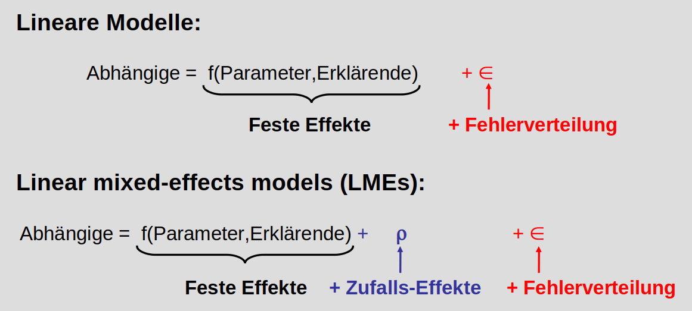
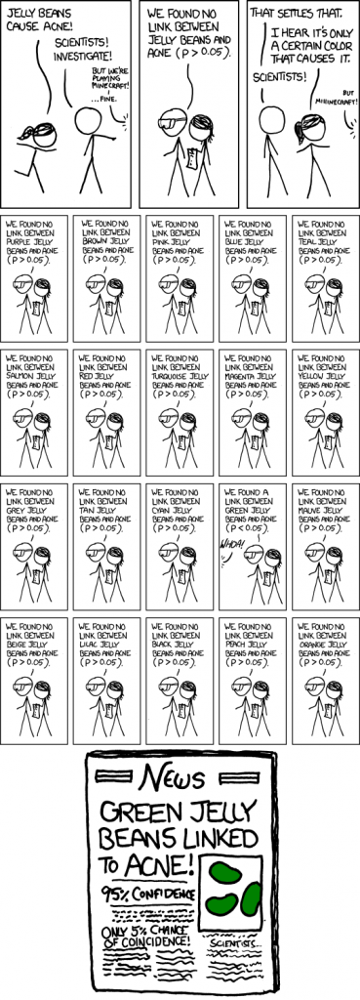
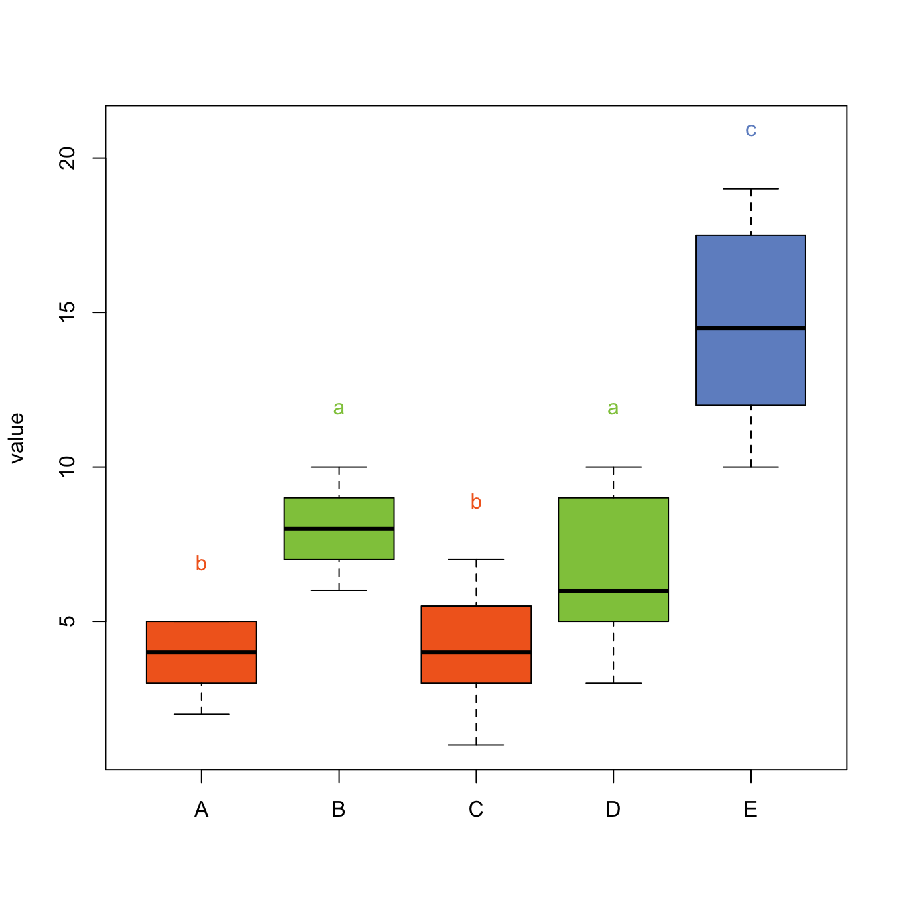

# Zeitreihen auswerten und PostHoc Tests {#zeitreihen}

Im Gartenbau und in den Agrarwissenschaften allgemein haben wir es viel mit Wachstum zu tun: Pflanzen wachsen, Früchte wachsen, Nutztiere wachsen. Auf dem Campus Klein Altendorf beschäftigen sich Wissenschaftler zum Beispiel mit dem Wachstum von Äpfeln und seine Abhängigkeit von verschiedenen Umweltfaktoren. Dazu gibt es unter folgendem Link ein [Video](https://uni-bonn.sciebo.de/s/8UbL5d6e2LQTdDc).    
In diesem Kapitel schauen wir uns an, wie solche Zeitreihen mit R dargestellt werden können und wie man Unterschiede im Wachstum (oder anderen über die Zeit aufgenommenen Parametern) analysieren kann. Am Ende des Kapitels

- haben Sie noch eine weitere Möglichkeit kennengelernt, die Funktionen von ggplot zu verwenden
- wissen Sie, was feste und zufällige Effekte in einem Modell sind und
- können gemischte lineare Modelle zur Analyse von Zeitreihen nutzen

## Zeitreihen plotten

Zunächst laden wir die library 'ggplot2', lesen die Wachstumsdaten aus der Datei 'Braeburn.csv' ein (im Order 'data' auf eCampus) und kontrollieren den Import. ID und Zeitpunkt wandeln wir in Faktoren um. Wie Sie sehen, haben wir Daten von 4 Früchten, 2 von Ästen mit niedrigen Behangdichten und 2 von Ästen mit hohen Behangdichten, deren Umfang stündlich gemessen wurde. 
```{r}
library(ggplot2)

Braeburn <- read.csv("data/Braeburn.csv", header = TRUE)
summary(Braeburn)
Braeburn$ID <- as.factor(Braeburn$ID)
Braeburn$Zeitpunkt <- as.factor(Braeburn$Zeitpunkt)
```

Um das Wachstum dieser 4 Früchte zu visualisieren, nutzen wir die ggplot Funktion und geben bei den Aestetics (ein Parameter der Funktion) den Zeitpunkt (x-Achse), den Umfang dividiert durch 1000 um von Mikro- auf Millimeter zu kommen (y-Achse) und den Behang (niedrig/hoch) für die Gruppierung durch Farbe an: 

```{r, fig.width= 8, fig.height=4}
ggplot(Braeburn, aes(Zeitpunkt, Umfang/1000, color=Behang)) + 
   geom_point() +   labs(y="Umfang (mm)", x="Zeit") +
   theme_bw()
```

Im besten Fall, insbesondere wenn wir Unterschiede im Wachstum durch verschiedene Behandlung statistisch nachweisen wollen, haben wir nicht nur 2 Wiederholungen wie hier sondern deutlich mehr. Dies ist im Datensatz 'Hühner' der Fall, in dem das Gewicht von Junghennen, die mit unterschiedlichem Futter aufgezogen wurden, über 21 Tage protokolliert wurde. 

Auch diesen Datensatz lesen wir ein (auch Ordner 'data) und wandeln 'Futter' und 'ID' in Faktoren um:

```{r}
Hühner <- read.csv("data/Huehner.csv", header = TRUE)
head(Hühner)
summary(Hühner)

Hühner$Futter <- as.factor(Hühner$Futter)
Hühner$ID <- as.factor(Hühner$ID)
```

Das entsprechende Diagramm sieht folgendermaßen aus:   

```{r, fig.width= 8, fig.height=4}
ggplot(Hühner, aes(Tag, Gewicht, color=Futter)) + 
   geom_point() +   labs(y="Gewicht (g)", x="Tage seit Geburt") +
   theme_bw()
```

Für eine bessere Übersicht wäre es wünschenswert, nicht alle Datenpunkte zu plotten¸ sondern den Mittelwert des Gewichts der Hühner einer Behandlung und ein Maß entweder für die Varianz in den Daten oder die Genauigkeit des Mittelwertes. Mit der ggplot-Funktion 'stat_summary' können wir genau das machen: der Wert 'mean_se' im Parameter 'fun.data' bewirkt, dass Mittelwert und Standardfehler des Mittelwertes berechnet und geplottet werden:

```{r, fig.width= 8, fig.height=4}
ggplot(Hühner, aes(Tag, Gewicht, color=Futter)) + 
  stat_summary(fun.data=mean_se, geom="pointrange") + 
  labs(y="Gewicht (g)", x="Zeit (Tage seit Geburt)")
```
 
Wir sehen in diesem Plot einen deutlichen Trend, nämlich dass das Futter des Typs 3 zu schnellerer Gewichtszunahme führt, als die übrigen. Die nächsten beiden Abschnitte erklären, wie wir testen, ob dieser Trend tatsächlich signifikant ist.

## Zufällige Effekte

Im Prinzip sollte man meinen, dass sich Gewichts- oder Wachstumsdaten gut eignen sollten, um eine Varianzanalyse durchführen zu können: sie sind kontinuierlich und wir erwarten im Prinzip eine Normalverteilung der Residuen. Allerdings ist eine grundlegende Annahme verletzt: die Unabhängigkeit der Daten. Wenn wir immer wieder den gleichen Apfel oder das gleiche Huhn messen, können wir davon ausgehen, dass die Werte einander ähnlicher sind, als wenn wir immer andere Indiviuen nehmen würden. Wir haben also keine echten unabhängigen Wiederholungen sondern **Pseudoreplikationen**. Andere Beispiele die zu Pseudoreplikationen führen sind Versuchsblöcke, Standorte, unterschiedliche Probennehmer, etc. 

Wie können solche Faktoren adäquat im Modell berücksichtigt werden? Der klassische Ansatz war lange, sie als 'normale' Variablen, also als **festen Effekt** mit ins Modell aufzunehmen. Das verbraucht aber viele Freiheitsgrade, weil für jeden Level des Zufallseffekts (also jedes Huhn) ein Parameter geschätzt wird (z.B. das mittlere Gewicht jedes Huhns, siehe Abbildung unten). Hier gibt es eine recht gute Erklärung für Freiheitsgrade: https://welt-der-bwl.de/Freiheitsgrade. Je weniger Freiheitsgrade es gibt, desto schwieriger ist es in einer Varianzanalyse, tatsächlich existierende Unterschiede in den Behandlungsgruppen auch als solche zu erkennen (Fähigkeit, Unterschiede zu erkennen = Power der Analyse). Deshalb ist der bessere Ansatz, die Variable als **Zufallseffekt** einzubeziehen. Das beruht auf der Annahme, dass die Basis-Parameter für jedes Level dieser Variable (jedes Huhn) aus einer gemeinsamen Verteilung stammen. Geschätzt werden muss für das Modell nur die Breite, also Varianz dieser Verteilung. Auf diese Weise wird nur 1 Freiheitsgrad verwendet und die Power der Analyse bleibt höher.


Feste Effekte 

- die geschätzten Paremeter sind von Interesse, es sind zum Beispiel die unterschiedlichen Behandlungslevels (Behangdichte, Futter, ...)
- die Namen der Levels haben eine (agrarwissenschaftliche) Bedeutung

Zufällige Effekte

- die geschätzten Parameter interessieren uns nicht
- die Namen der Level haben keine agrarwissenschafliche Bedeutung
- nur einbezogen, um Pseudoreplikation zu vermeiden (ID des Huhn, des Apfels, Block, Ort, Probennehmer)

## Zeitreihen analysieren

Um zufällige Faktoren zu berücksichtigen, benötigen wir **gemischte Modelle**. 



Ein Paket, das Funktionen für gemischte Modelle zur Verfügung stellt ist 'lme4'. Dieses Paket laden wir jetzt (nachdem Sie es installiert haben).

```{r}
library(lme4)
```
  
Die Funktion lmer() fitted lineare gemischte Modelle. Die abhängige Variable und die festen erklärenden Variablen werden wie bekannt in Zusammenhang gebracht: In unserem Beispiel steht das Gewicht links von der Tilde und Tag und Futter werden mit einem Multiplikationszeichen verbunden, um auszudrücken, dass in dem Modell beide Faktoren und ihre Interaktion einen Einfluss auf das Gewicht haben können. Dahinter kommen in runden Klammern die Zufallseffekte: Hier gehen wir davon aus, dass es einen Zufallseffekt geben könnte (individuelle Unterschiede im Gewicht der Hühner), der sich auf den y-Achsenabschnitt der Zeitreihen auswirkt. Das wird ausgedrückt, indem die ID hinter den senkrechten Strich geschrieben wird. Um die Modelle im Anschluss vergleichen zu können, müssen wir noch die Standardmethode 'REML' auf 'FALSE' setzen.

```{r}
model1 <- lmer(Gewicht ~ Tag * Futter + (1| ID), data = Hühner, REML = FALSE)
```
 
Danach geht es wie gewohnt weiter: wir vereinfachen das Modell, zuerst durch Ersetzen des Multiplikationszeichens mit einem Additionszeichen, womit wir die Interaktion zwischen Tag und Futter rauswerfen. Ist die Interaktion nicht signifikant, nehmen wir als nächstes das Futter ganz raus. Der Zeitpunkt (=Tag) sollte bei solchen Zeitreihen-Analysen allerdings immer im Modell bleiben, es sei denn, wir gehen davon aus, dass es möglicherweise gar keine Veränderung der abhängigen Variable über die Zeit gibt.

```{r}
model2 <- lmer(Gewicht ~ Tag + Futter + (1 | ID), data=Hühner, REML = F)
model3 <- lmer(Gewicht ~ Tag + (1 | ID), data=Hühner, REML = F)
```

Dann kann man die Modelle mittels anova() vergleichen. Wie Sie sehen, können auch mehrere Modelle gleichzeitig verglichen werden.

```{r}
anova(model1, model2, model3)
```

Sie sehen, dass sowohl der Einfluss des Futters auf den Gewichtsverlauf als auch die Interaktion zwischen Futter und Tag hochsignifikant sind.
Die Vorhersagen des besten Modells (also model1) können wir nun noch zu dem Plot hinzufügen:

```{r, fig.width=8, fig.height=4}
last_plot() + stat_summary(aes(y=fitted(model1)), fun=mean, geom="line")
``` 


## Post-hoc Tests

Nachdem wir in den letzten Kapiteln Varianzanalysen mit verschiedenen Datentypen besprochen haben, können Sie testen, ob eine erklärende Variable "signifikant" ist, also ihr Einbezug in ein Modell die übrigbleibenden Fehler (=Residuen) signifikant reduziert. Was Sie noch nicht wissen ist, welche der Level (=Behandlungsgruppen) der erklärenden Variable signifikant unterschiedlich sind. Zum Beispiel haben Sie beim Ansaaten-Versuch den Effekt von 4 verschiedene Substraten auf die Keimungsrate von 2 Arten getestet. Mit einer ANOVA finden Sie heraus, ob das Substrat grundsätzlich einen signifikaten Effekt auf die Keimungsrate hat. Bei WELCHEM Substrat oder welchen Substraten aber die Keimungsrate signifikant höher ist oder sind als bei den anderen, wissen Sie noch nicht. Um das herauszufinden, benutzen wir post-hoc Tests, also Tests, die nach der ANOVA durchgeführt werden.

Am Ende dieses Kapitels wissen Sie 

- um die Problematik der multiplen post-hoc Tests
- wie Sie solche Tests sinnvoll durchführen können

--------------

## Post-hoc Tests - die Problematik

Natürlich können wir jetzt jedes Substrat nochmal einzeln mit einer ANOVA gegen jedes andere Substrat testen und schauen, ob das Ergebnis siginifkant ist. Allerdings gibt es dabei ein Problem: jeder Test hat per Definition eine Irrtumswahrscheinlichkeit von 5% (wir nennen eine erklärende Variable signifikant, wenn der p-Wert, also die Wahrscheinlichkeit solche oder noch extremere Daten zu finden, obwohl die Null-Hypothese wahr ist, kleiner als 0.05 = 5% ist). Je mehr Vergleiche wir machen, desto höher ist also auch die Wahrscheinlichkeit, dass wir in der gesamten Auswertung eine Signifikanz finden, obwohl gar kein wahrer Effekt vorhanden ist - das Problem der multiplen Tests.




Einige Statistiker sagen deshalb, dass post-hoc Tests grundsätzlich vermieden werden sollten und auch nicht nötig sind, wenn das experimentelle Design des zugrundeliegenden Versuchs nur gut genug angelegt wurde. Die agrarwissenschaftlichen Realität sieht aber oft anders aus: es wird häufig eine Vielzahl von Behandlungslevels gegeneinander getestet und es interessiert uns nicht nur, OB die Wahl des Substrats einen Effekt auf die Keimungsrate einer Art hat, sondern auch bei welchem davon die Keimungsrate signifikant höher ist. Wahr ist aber, dass man gut durchdenken sollte, wann post-hoc Tests wirklich gebraucht werden und wie genau man sie durchführt.

## Die Herangehensweise

Die generelle Herangehensweise ist, dass man für die Anzahl an Vergleichen, die man macht, korrigiert, indem die einzelnen Signifikanz-Niveaus so angepasst werden, dass man INSGESAMT auf eine Irrtumswahrscheinlichkeit von 5% kommt. Gängige Ansätze sind die Bonferroni-Korrektur und der Tukey's HSD Test. Hier nutzen wir eine angepasste Bonferroni Korrektur, die sich 'Holm' nennt. Wer sich für die methodischen Details interessiert findet [hier](https://statistikguru.de/lexikon/bonferroni-holm-korrektur.html) eine recht gute Erklärung.

Bitte laden Sie die Daten zum Ansaaten-Versuch von diesem Jahr herunter: https://ecampus.uni-bonn.de/goto_ecampus_file_2859385_download.html   
und installieren Sie das R-Paket 'multcomp'.

```{r}
# Laden der benötigten Pakete
library(multcomp)
library(tidyverse)

# Einlesen der Daten und Umwandeln der erklärenden Variablen in Faktoren
ansaaten <- read.csv("data/Ansaaten_neu.csv", header = TRUE)
ansaaten$Art <- as.factor(ansaaten$Art)
ansaaten$Substrat <- as.factor(ansaaten$Substrat)

# Kombinieren der beiden Spalten mit Anteilsdaten
ansaaten$keimung <- cbind(ansaaten$Angelaufen, ansaaten$Ausfälle)

# Umformen des Datensatzes, um einen Plot zu machen
Keimung_w <- reshape(ansaaten, 
                     direction = "long",
                     varying = list(names(ansaaten)[4:5]),
                     v.names = "Anzahl",
                     idvar = c("Art", "Substrat", "Wdh"),
                     timevar = "Beobachtung",
                     times = c("Ausfaelle", "Angelaufen"))
head(Keimung_w)
```

```{r}
# Plot
ggplot(Keimung_w, aes(x=factor(Wdh), y=Anzahl, fill=Beobachtung)) +
  facet_grid(. ~ Art * Substrat) +
  geom_bar(position="stack", stat="identity") +
  scale_fill_manual("legend", 
                    values = c("Angelaufen" = "darkgreen", "Ausfaelle" = "lightgrey")) +
  geom_col(position = position_stack(reverse = TRUE))
```

```{r}

# Generalisiertes lineares Modell unserer Hypothese: 
# Substrat und Art haben einen Effekt auf die Keimungsrate
model1 <- glm(keimung ~ Substrat * Art, family=quasibinomial, data = ansaaten)

# Genestetes Modell ohne den Effekt von 'Substrat', 
# um die Signifikanz dieser Variable testen zu können
model2 <- glm(keimung ~ Art, family = quasibinomial, data = ansaaten)

# Varianzanalyse der beiden Modelle
anova(model1, model2, test = "F")


```

Mit der Funktion `interaction()` generieren wir jetzt eine neue Spalte 'gruppe', in der die erklärenden Variablen kombiniert werden. Mit diesen Behandlungsgruppen fitten wir ein neues glm, um sie dann in einem nächsten Schritt in einer post-hoc Analyse gegeneinander testen zu können.  

```{r}
ansaaten$gruppe<-interaction(ansaaten$Art, ansaaten$Substrat)
head(ansaaten)
model_posthoc <- glm(keimung ~ gruppe, family=quasibinomial, data = ansaaten)
```

Bevor wir das tun, sollten wir überlegen, welche Gruppen wir tatsächlich vergleichen wollen. Die Abbildung oben legt nahe, dass Jiffy stripes zu einer höheren Keimungsrate führen als Steinwolle und Sand und wir wollen vielleicht testen, ob diese Unterschiede signifikant sind. In der Funktion `glht` , die den post-hoc Test für uns durchführt können wir festlegen, welche Gruppen wir gegeneinander testen wollen: 


```{r}
summary(glht(model_posthoc, 
             linfct = mcp(gruppe =
#Ist die Differenz zwischen diesen Gruppen ungleich 0?
            c("(Bohne.Jiffy)-(Bohne.Sand)=0",
              "(Bohne.Steinwolle)-(Bohne.Sand)=0"))),test = adjusted("holm"))
```
Jetzt sehen Sie, dass der Unterschied zwischen Jiffy stripes und Sand bei der Bohne signifikant ist, der Unterschied Steinwolle - Sand aber nicht. 


Signifikante Unterschiede, die zwischen den Behandlungsgruppen gefunden wurden, werden in Abbildungen häufig durch verschiedene Buchstaben gekennzeichnet. Zum Beispiel so (hier liegen andere Daten zugrunde): 



Allerdings bietet R keine guten Standardlösungen dafür an. Wenn Sie den TukeyHSD Test durchführen, bietet das Packet 'multcompView' eine Möglichkeit. R-Code um die Abbildung oben zu erstellen finden Sie [hier](https://r-graph-gallery.com/84-tukey-test.html). 

