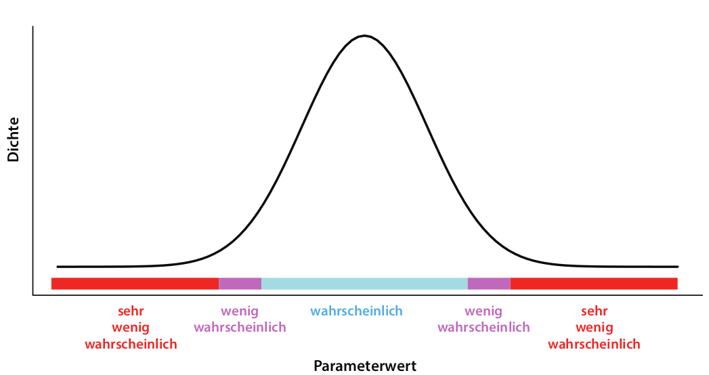

#  Bayesische Auswertung (19. Dez){#bayes}

Auch im agrarwissenschaftlichen Bereich findet man zunehmend Studien, die nicht auf dem Formulieren von Null-Hypothesen und deren Testen mittels p-Werten beruhen (die frequentistische Statistik), sondern sich die Vorteile der Bayes-Statistik zunutze machen. Dazu gehören vor allem die intuitiver zu interpretierende Ergebnisse und die Möglichkeit, schon vorhandenes Wissen formalisiert in die Analyse einbeziehen zu können. Deshalb möchten wir Ihnen die Bayes-Statistik nicht vorenthalten! Das folgende Kapitel stützt sich stark auf einen sehr gut geschriebenen Artikel "Kurze Einführung in Bayes-Statistik mit R für Ornithologen" (2016) von Fränzi Korner-Nievergelt & Ommo Hüppop in 'Die Vogelwarte'. Am Ende des Kapitels kennen Sie

- das Prinzip der Bayesischen Statistik,
- Möglichkeiten, sie mit Hilfe des R-Packets 'bmrs' anzuwenden und
- die Unterschiede zwischen frequentistischer und bayesischer Statistik bezüglich der Interpretation der Ergebnisse

---------------

## Der Satz von Bayes

Keine Einführung in die Bayesische Statistik kommt ohne den Satz von Bayes aus: Thomas Bayes war ein englischer Geistlicher, Philosoph und Statistiker von dem 1763 - posthum - ein Manuskript mit dem Titel 'An essay towards solving a problem in the doctrine of chances' veröffentlicht wurde. In diesem beschreibt er, wie basierend auf vorhandenem Wissen und zusätzlichen Beobachtungen **X** die Wahrscheinlichkeit dafür berechnet werden kann, dass eine Hypothese **H** zutrifft: 

$$P(H|X) = \frac {P(X|H)×P(H)}{P(X)}$$    

In Worten ausgedrückt: Die Wahrscheinlichkeit (P = probability) dass die Hypothese zutrifft, nachdem wir die Daten betrachtet haben (P(H|X), **a-posteriori** Wissen), ist gleich der Wahrscheinlichkeit, die Daten so zu beobachten, angenommen die Hypothese trifft zu (P(X|H), **Likelihood**), mal der Wahrscheinlichkeit, dass die Hypothese zutrifft, bevor wir die Daten betrachtet haben (P(H), **a-priori Wissen** oder **Prior**), geteilt durch die Wahrscheinlichkeit die Daten so zu beobachten ohne irgendeine Annahme zur Hypothese (P(X), Normalisierungskonstante).    
Wichtig ist noch anzumerken, dass Hypothesen dabei als Parameterwerte ausgedrückt werden. Ist unsere Hypothese also, dass unter Behandlung A der Mittelwert der abhängigen Variable größer ist als unter Behandlung B, berechnen wir die Wahrscheinlichkeit für den Parameter Mittelwert(A) - Mittelwert(B) und bekommen als Ergebnis, mit welcher Wahrscheinlichkeit er > 0 ist. 


## Das Prinzip des Bayes-Statistik

In der Bayes-Statistik wird diese Idee verwendet, um bereits vorhandenes Wissen - das A-priori-Wissen (P(HP)) - mit den Information, die in den neu erhobenen Daten X stecken zu kombinieren und so das 'geupdatete- A-posteriori-Wissen zu generieren. Wir sehen außerdem, dass wir als Ergebnis die Wahrscheinlichkeit unserer Hypothese bekommen. Das ist wesentlich leichter bekömmlich und näher an unserem 'normalen' Denken als die Interpretation eines p-Wertes: 'Die Wahrscheinlichkeit solche oder extremere Daten zu finden, wenn die Null-Hypothese wahr ist'. 

> **Exkurs: Wahrscheinlichkeitsverteilungen**\
>  Um Wahrscheinlichkeiten darzustellen, zum Beispiel das a-priori Wissen, werden Wahrscheinlichkeitsverteilungen verwendet. In der foldenden Abbildung sehen Sie eine solche Wahrscheinlichkeitsverteilung: Je höher die Dichte, desto wahrscheinlicher der Parameterwert, der auf der x-Achse abgetragen ist. Die Gesamtfläche unter der Kurve beträgt immer 1 (genau irgendein Parameterwert trifft immer zu). 

Wie berechnen wir also diese Wahrscheinlichkeit? Leider ist das meistens nicht ganz so trivial, wie es aussieht. Zwar können wir meistens die Likelihood berechnen (das wird auch in der frequentistischen Statistik zur Bestimmung der Parameterwerte unserer Modelle gemacht) und unser a-priori Wissen durch eine Wahrscheinlichkeitsverteilung festlegen. Schwierig wird es aber, zumindest sobald wir keine ganz simplen Modelle mehr haben, bei dem Teil P(X), der Wahrscheinlichkeit der Daten. Hierzu müsste man die Wahrscheinlichkeit der Daten über alle überhaupt möglichen Parameterwerte integrieren und das ist oft nicht möglich. Zum Glück kann dieses Problem aber mit einer Simulationstechnik, die in den 80er und 90er Jahren entwickelt wurde, umgangen werden:

### MCMC - Markov Chain Monte Carlo

MCMC-Verfahren können Wahrscheinlichkeitsverteilung annähern (in diesem Fall P(H|X)), die man nicht analystisch berechnen kann. Die intuitivste und ziemlich geniale Erklärung, die ich dazu gefunden habe ist die von Michael Franke auf seiner github Seite https://michael-franke.github.io/intro-data-analysis/Ch-03-03-estimation-algorithms.html
Ich habe sie hier in Teilen übersetzt:


> **Wie die Äpfel an die Bäume kommen**\
> Jedes Jahr im Frühling schickt Mutter Natur die Kinder los, um Äpfel in den Apfelbäumen zu verteilen. Für jeden Baum soll die Anzahl der Äpfel proportional zur Anzahl der Blätter sein: Riese Ralf mit doppelt so vielen Blättern wie Dünner Daniel soll also am Ende auch doppelt so viele Äpfel haben. Wenn es also insgesamt $n_a$ Äpfel gibt, und $L(t)$ die Anzahl der Blätter von Baum $t$ ist, soll jeder Baum $A(t)$ Äpfel bekommen.

$$A(t) = \frac {L(t)}{\sum L(t')}n_a$$ 

> Das Problem ist nur, dass Mutter Natur $\sum L(t')$ (die Normalisierungskonstante) nicht ausrechnen kann, also nicht weiß, wie viele Blätter alle Bäume zusammengenommen haben.     
Die Kinder (Markov-Ketten) können aber zählen. Sie können zwar nicht alle Bäume besuchen und sich die Zahlen auch nicht so lange merken, aber immerhin für je zwei Bäume. Was sie jetzt tun, ist folgendes: sie starten je an einem zufälligen Baum (Parameterwert), hängen schonmal einen Apfel rein, zählen dort die Blätter $L(t_1)$ und suchen dann nach einem Baum in der Nähe, von dem sie auch die Blätter zählen $L(t_2)$ (der Zähler unserer Verteilung). Ist die Zahl der Blätter im zweiten Baum höher, gehen sie dort auf jeden Fall hin und hängen einen Apfel hinr
ein. Ist sie niedriger gehen sie nur mit der Wahrscheinlichkeit $L(t_2)/L(t_1)$ dorthin und hängen einen Apfel auf. So laufen sie weiter zwischen den Bäumen hin und her und am Ende sind die Äpfel ungefähr richtig verteilt. Je mehr Äpfel es sind, desto besser das Ergebnis. Die Besuchshäufigkeit der Kinder hat sich also der gewünschten Verteilung (die Mutter Natur nicht ausrechnen konnte) angenähert!

MCMC Verfahren machen das gleiche: eine MCMC Kette zieht zufällig Werte für die Modell-Parameter und berechnet damit Ergebnis1 = Likelihood der Daten * Prior. Dann zieht sie zufällig Werte, die um die ersten Werte herum liegen, und berechnet dafür wiederum Likelihood der Daten * Prior = Ergebnis2. Wenn Ergebnis2 höher ist als Ergebnis1, springt sie dorthin und zieht von dort aus neue Parameter-Werte. Wenn das Ergebnis2 niedriger ist, springt sie nur mit der Wahrscheinlichkeit Ergebnis2/Ergebnis1 dorthin. Jetzt werden wieder zufällig Werte gezogen usw.    
In der folgenden Abbildung sind die erfolgreichen Sprünge durch blaue Pfeile symbolisiert, die abgelehnten Sprünge durch grüne Pfeile.  


Wenn dieser Prozess lang genug fortgesetzt wird, nähert sich die Verteilung der blauen Punkte der a-posteriori Wahrscheinlichkeitsverteilung der Parameter an, die wir haben wollen: Wir haben a-priori Wissen und die Information, die in den neu gesammelten Daten steckt, erfolgreich zum a-posteriori Wissen kombiniert!


## Ein (etwas konstruiertes) Beispiel

Wir müssen uns entscheiden, welche Hühnerrasse wir in größerem Maßstab auf unserer Streuobstwiese halten möchten. Wir haben selbst schon 3 Kraienköppe und 6 Niederrheiner. Die Niederreihner sind uns ein bisschen lieber, weil sie weniger aggressiv sind, aber die Kraienköppe scheinen eine etwas höhere Legeleistung zu haben. Ist es deshalb wirklich sinnvoll, eher Kraienköppe zu wählen?

**Schritt 1: Definition der A-priori-Wahrscheinlichkeitsverteilung**

Wir erkundigen uns über die Legeleistung der beiden Rassen und erfahren, dass Niederrheiner zwischen 190 und 210 Eier pro Jahr legen, Kraienköppe zwischen 200 und 220. Entsprechend formulieren wir unsere a-priori Wahrscheinlichkeitsverteilungen: 

```{r}
library(brms, warn.conflicts=F, quietly=T)
# mit der Funktion set_prior definieren wir 2 Normalverteilungen, eine mit Mittelwert 200 
# und Standardabweichung 1,5, und eine mit Mittelwert 210 und Standardabweichung 1,5. 
# Unter 'coef' legen wir fest, zu welchen Parameter im Modell, das wir später 
# fromulieren, diese Priors gehören.
priors <- c(set_prior("normal(200, 5)", coef = "rasseN"), set_prior("normal(210, 5)", coef = "rasseK"))

#So können wir sie plotten, um ein Gefühl dafür zu bekommen
curve(dnorm(x, 200, 5), from = 170, to = 230, xlab="Legeleistung", ylab="Dichte")

```

**2. Erhebung von neuen Daten**

Jetzt geben wir unsere eigenen Beobachtungen der Legeleistung der 3 Kraienköppe und 6 Niederrheinern aus dem vorigen Jahr an: 

```{r}
rasse <- c("K", "K", "K", "N", "N", "N", "N", "N", "N")
ll <- c(225, 222, 221, 219, 219, 216, 221, 218, 217)
daten <- data.frame(rasse=rasse, ll=ll)
```

**3. Kombination der a-priori-Verteilung mit den Daten, um die a-posteriori-Verteilung zu erhalten**

Um die a-posteriori Verteilung zu schätzen nutzen wir die Funktion 'brm' des Packets 'brms'. Wie wir es schon von anderen Auswertungen kennen, formulieren wir zuerst unser Modell, nämlich das die Legeleistung ll von der Rasse abhängt. Die -1 in der Modell-Formel bewirkt, dass das Modell die Mittelwerte für die Legeleistung schätzt und nicht nur den Mittelwert für die erste Rasse und den Unterschied dazu. Unter 'data' geben wir unsere selbst erhobenen Daten ein und unter 'prior' die oben definierten Priors. Das argument 'silent' bestimmt, wie viele Informationen auf der Konsole ausgegeben werden, wenn die MCMC Ketten loslaufen. Diese Simulationen laufen je nach Modell-Komplexizität einige Sekunden oder Minuten.

```{r, results='hide'}
legeleistung <- brm(ll ~ rasse -1, data = daten, prior = priors, silent = 2)

```
  
**4. Interpretation**

Der obige Code hat die MCMC Simulation durchgeführt und wir können uns jetzt die a-posteriori Verteilungen für die Legeleistungen der Hühnerrassen anschauen:

```{r}
# So kann man sich die Zusammenfassung anschauen
summary(legeleistung)
```
Die Zusammenfassung zeigt uns zuerst nochmal unsere Eingaben und ein paar Informationen zu den Markov-Ketten. Am interessantesten für uns sind natürlich die Schätzer für rasseK und rasseN und ihre Kredibilitätsintervalle. Wie Sie sehen, überschneiden sich die Konfidenzintervalle: der untere Wert von rasseK (l-95%) ist mit etwa 218 kleiner als der obere Wert (u-95%) von etwa 219 von rasseN, die legeschwächer ist.)
Sigma ist die geschätzte Standardabweichung der angenommenen Normalverteilung und interessiert uns hier weniger.

```{r}
plot(legeleistung)
```

In der Abbildung sind die Ergebnisse noch leichter zu interpretieren. Links sehen Sie die a-posteriori Verteilungen für beide Rassen (beachten Sie, dass die x-Achsen der beiden oberen Verteilungen nicht ausgerichtet sind). Rechts daneben die Dynamik der Markov-Ketten.
Aus den a-posteriori Verteilungen ließe sich jetzt auch die genaue Wahrscheinlichkeit berechnen, dass die Legeleistung wirklich unterschiedlich ist. Da wir aber schon gesehen haben, dass die Kredibilitätsintervalle sich überschneiden, bleiben wir bei unserer Vorliebe für die Niederrheiner, auch wenn es nicht ausgeschlossen ist, dass sie ein paar Eier weniger legen.


## Frequentistisch versus Bayesisch

| Frequentistisch | Bayesisch |
|----------------|---------------|
|Wahrscheinlichkeit für Daten, in Bezug auf Hypothese nur ja/nein Antwort        |Wahrscheinlichkeit für Hypothesen |
|Vertrauensintervall: in welchem Intervall erwarten wir 95% der Mittelwerte von weiteren Zufallsstichproben gleicher Stichprobengröße       |Kredibilitätsintervall: in welchem Wertebereich liegt mit einer Wahrscheinlichkeit von 95 % der wahre Mittelwert der Population             |
|Annahme, dass es **einen** 'wahren' Wert gibt, die Beobachtungen aber zu einer Verteilung führen       |Annahme, dass die beobachteten Werte wahr sind und eine intrinsische Varianz haben   |

Die sinnvollere Interpretierbarkeit der Ergebnisse von bayesischen Analysen wird am besten durch folgene Abbildung dargestellt: 

![Quelle: Korner-Nievergelt und Hüppop (2016). Fünf mögliche Resultate der Schätzung eines Effektes, zum Beispiel der Unterschied im Ertrag bei anderer Düngung. Die Punkte geben die geschätzten Differenzen, die vertikalen Balken die 95 % Unsicherheitsintervalle (Vertrauensintervall bzw. Kredibilitätsintervall) an. Die Resultate des zugehörigen Nullhypothesentest sind in der ersten Zeile aufgeführt. In der zweiten Zeile finden sich die posterior Wahrscheinlichkeit für die Hypothese, dass der Effekt „wirtschaftlich relevant“ ist. Die Hintergrundfarbe unterscheidet schematisch „wirtschaftlich relevante“ (orange) von „wirtschaftlich nicht relevanten“ (hellblau) Effektgrößen.](images/effektgroesse.png)

Bei einem unkritischen frequentistischen Ansatz würde das Ergebnis lauten: "Der Effekt bei Gruppe/Behandlung A und E ist signifikant, also Düngen wir jetzt mit dem getesteten Mittel. Bei den anderen Gruppen gibt es anscheinend keinen Einfluss."    
Natürlich gibt es auch in B einen wichtigen Effekt und auch wenn der Effekt in E statistisch signifikant ist, ist die Effektgröße auf den Ertrag so klein, dass es von wirtschaftlichem Standpunkt aus wahrscheinlich keinen Sinn macht, zusätzlich zu düngen. 
Die Ergebnisse der bayesischen Analyse (also die Wahrscheinlichkeiten für die Hypothese, dass es einen Effekt gibt), spiegeln diese Interpretationen viel direkter wider. 

Auch in diesem Kapitel gibt es eine Quiz-Fragen.